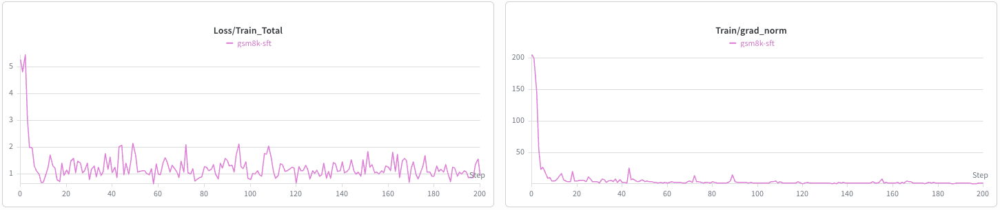
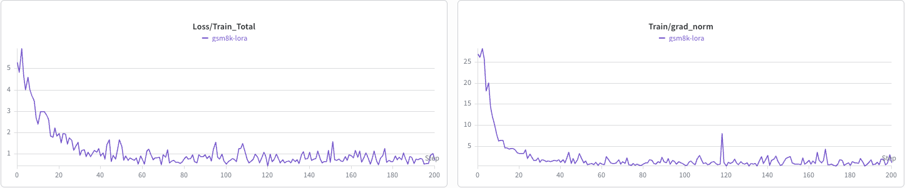

# Fine-Tuning DiffusionGemma with NeMo AutoModel

## Introduction

**DiffusionGemma** is a block-diffusion language model. Unlike an autoregressive (AR)
model that generates one token at a time left-to-right, a block-diffusion model fills in
a block of response tokens (a "canvas") by **iteratively denoising** it: the canvas starts
as noise and is refined over several passes, conditioned on the prompt.

This guide covers **supervised fine-tuning (SFT)** of the DiffusionGemma **26B-A4B** model
(a Mixture-of-Experts model with 26B total / ~4B active parameters) in NeMo AutoModel,
with both **full fine-tuning** and **LoRA**.

The released checkpoint is available on the Hugging Face Hub:
[`google/diffusiongemma-26B-A4B-it`](https://huggingface.co/google/diffusiongemma-26B-A4B-it).

### Workflow overview

| Step | What you do |
|------|-------------|
| 1. Install | Install NeMo AutoModel (pip or container) |
| 2. Configure | Pick an example YAML (full SFT or LoRA) and set your dataset |
| 3. Train | Launch with `torchrun` on 8 GPUs |
| 4. Inspect | Read the training/diffusion loss curves |

## Model Overview

DiffusionGemma couples a **causal encoder** with a **bidirectional decoder**:

- **Encoder** reads the clean prompt + response sequence with causal attention.
- **Decoder** denoises the **canvas** — the response region — with bidirectional
  (block-causal) attention, predicting the clean token at every canvas position.

Key training mechanics, all handled by the `DiffusionGemmaSFTRecipe`:

- **Uniform-random corruption.** For each example a corruption level `t ~ U(eps, 1)`
  is sampled; supervised canvas positions are independently replaced with **uniform random
  vocabulary tokens** (there is no `[MASK]` token). The model learns to recover the clean
  token at every supervised canvas position.
- **Self-conditioning.** The decoder optionally conditions on its own previous prediction,
  mixed in per example during training.
- **Frozen router.** The MoE router is kept frozen during SFT; experts and dense layers
  are trained (full SFT) or adapted via LoRA.
- **Single-turn SFT.** The loss supervises the final response turn; multi-turn histories
  are masked.

The recipe runs with **FSDP2 + expert parallelism (EP=8)** and **mixed precision**
(fp32 master weights, bf16 compute), with a canvas length of 256.

## Launch Training

DiffusionGemma SFT runs on a single 8-GPU node (EP=8). Two example configs are provided
under `examples/dllm_sft/`:

| Config | Description |
|--------|-------------|
| [`diffusion_gemma_sft.yaml`](../../../examples/dllm_sft/diffusion_gemma_sft.yaml) | Full fine-tune on [GSM8K](https://huggingface.co/datasets/openai/gsm8k) |
| [`diffusion_gemma_lora.yaml`](../../../examples/dllm_sft/diffusion_gemma_lora.yaml) | LoRA fine-tune  |

Both pull the checkpoint from the Hugging Face Hub
(`google/diffusiongemma-26B-A4B-it`) automatically. GSM8K is consumed in OpenAI
chat-messages format, so generate the JSONL once before launching:

```bash
python examples/dllm_sft/prep_gsm8k.py        # writes ./gsm8k_chat_train.jsonl
```

**Full SFT:**

```bash
torchrun --standalone --nproc-per-node=8 \
    examples/dllm_sft/finetune.py \
    -c examples/dllm_sft/diffusion_gemma_sft.yaml
```

**LoRA:**

```bash
torchrun --standalone --nproc-per-node=8 \
    examples/dllm_sft/finetune.py \
    -c examples/dllm_sft/diffusion_gemma_lora.yaml
```


## Training Results

The SFT and LoRA training curves on GSM8K (first 200 steps) are shown below.

**SFT**



**LoRA**




## Requirements

> **Note:** This recipe requires `transformers >= 5.11.0` — the `DiffusionGemma`
> model was only added to `transformers` in 5.11, so earlier versions can't load
> the checkpoint. Please install a compatible `transformers` version in your
> environment before running this recipe.
