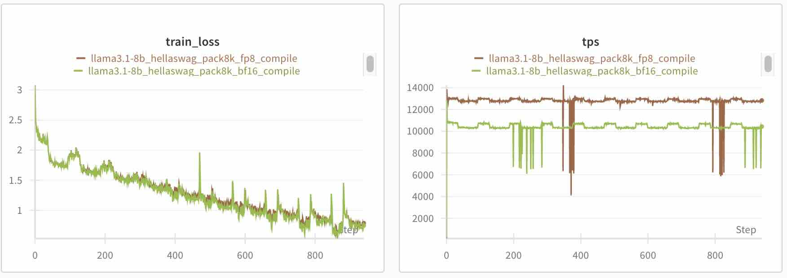

NeMo AutoModel supports FP8 quantization using [TorchAO](https://github.com/pytorch/ao) and `torch.compile` to accelerate training on compatible hardware.

FP8 (8-bit floating point) quantization can provide substantial speedups for models where the majority of general matrix multiplications (GEMMs) are sufficiently large. The speedup from using FP8 tensor cores must outweigh the overhead of dynamic quantization.

## Requirements for FP8 Training in NeMo AutoModel

Before you enable FP8 training, check the hardware, software, and configuration:

- **Hardware**:  
  Use an NVIDIA GPU supported by your TorchAO FP8 recipe. NeMo AutoModel checks for CUDA compute capability 8.9 or later when hardware acceleration is enabled; individual TorchAO recipes can have additional requirements. The benchmark below uses H100 GPUs.

- **Software**:  
  The TorchAO library must be installed.

- **Configuration**:  
  Set `fp8.enabled: true` to enable FP8 conversion and `compile.enabled: true` to enable `torch.compile` for performance. Compilation is essential for achieving meaningful speedup with TorchAO FP8 training.

## Install TorchAO

Make sure you have TorchAO installed. Follow the [installation guide](https://github.com/pytorch/ao?tab=readme-ov-file#-installation) for TorchAO.

## Usage

### Configure FP8

To enable FP8 quantization with `torch.compile`, you need both FP8 and compilation enabled in your configuration:

```yaml
# Enable torch.compile (required for FP8 speedup)
compile:
  enabled: true
  mode: "default"
  fullgraph: false
  dynamic: false

# Enable FP8 quantization
fp8:
  enabled: true
  recipe_name: tensorwise
  enable_fsdp_float8_all_gather: true
  precompute_float8_dynamic_scale_for_fsdp: true
  force_recompute_fp8_weight_in_bwd: true
  filter_fqns: ["lm_head"]
  emulate: false
```

### FP8 Config Parameters

| Parameter | Type | Default | Description |
|-----------|------|---------|-------------|
| `enabled` | `bool` | `False` | Enable FP8 conversion |
| `recipe_name` | `str` or `None` | `None` | FP8 recipe: `"tensorwise"`, `"rowwise"`, or `"rowwise_with_gw_hp"`. `None` uses tensorwise scaling |
| `enable_fsdp_float8_all_gather` | `bool` | `False` | Enable FP8 all-gather in Fully Sharded Data Parallel (FSDP) for bandwidth savings |
| `force_recompute_fp8_weight_in_bwd` | `bool` | `False` | Force recomputation of FP8 weights in the backward pass |
| `precompute_float8_dynamic_scale_for_fsdp` | `bool` | `False` | Precompute FP8 scales for FSDP; use with `recipe_name: tensorwise` and `enable_fsdp_float8_all_gather: true` |
| `filter_fqns` | `list[str]` | `[]` | Substrings of fully qualified module names to exclude from FP8 conversion |
| `emulate` | `bool` | `False` | Use emulation instead of hardware acceleration for testing |

The `enable_fsdp_float8_all_gather`, `force_recompute_fp8_weight_in_bwd`, and `emulate` overrides apply when `recipe_name` is `tensorwise` or `None`. The rowwise recipes use TorchAO's preset values for these options.

### Scaling Strategies

#### Tensorwise Scaling (Default)
- Single scale per tensor
- Good performance, moderate accuracy
- Recommended for most use cases

#### Rowwise Scaling
- Scale per row for better accuracy
- Slower than tensorwise
- Better numerical stability

For more on scaling strategies, refer to the [TorchAO FP8 documentation](https://docs.pytorch.org/ao/main/workflows/training.html#float8).

## Filter Modules

You can exclude modules from FP8 conversion using `filter_fqns`. Each entry matches any fully qualified module name that contains that substring:

```yaml
fp8:
  enabled: true
  recipe_name: tensorwise
  filter_fqns: ["lm_head"]  # Skip these modules
```

## Speed and Convergence

The Llama 3.1 8B HellaSwag benchmark shown below compares tensorwise FP8 with BF16 training on eight H100 GPUs using an 8,192-token sequence length and `torch.compile`. The reported results for this workload are:

- **Speed**: Over 1.2x training speedup with tensorwise scaling.
- **Convergence**: Similar training loss curves for FP8 and BF16.
- **Memory**: Memory usage comparable to the BF16 baseline.

Speedup, memory use, and convergence depend on the model, workload, and configuration.



*Figure: Training loss and throughput for Llama 3.1 8B on HellaSwag, comparing tensorwise FP8 and BF16 with `torch.compile` on eight H100 GPUs at an 8,192-token sequence length. This benchmark reports similar loss curves and a 1.24x speedup.*

## Ready-to-Use Recipes
We provide FP8 training configs for popular models:

- **Llama**: [Llama 3.1 8B](https://github.com/NVIDIA-NeMo/Automodel/blob/main/examples/llm_finetune/llama3_1/llama3_1_8b_hellaswag_fp8.yaml)
- **Qwen**: [Qwen 2.5 7B](https://github.com/NVIDIA-NeMo/Automodel/blob/main/examples/llm_finetune/qwen/qwen2_5_7b_hellaswag_fp8.yaml)

Check out our [examples directory](https://github.com/NVIDIA-NeMo/Automodel/tree/main/examples/llm_finetune) for more recipes and configurations.

Run this command from the repository root to train Llama 3.1 8B on eight GPUs. To use the Qwen recipe, replace `CONFIG_PATH` with its path:

```bash
CONFIG_PATH=examples/llm_finetune/llama3_1/llama3_1_8b_hellaswag_fp8.yaml
uv run automodel --nproc-per-node=8 "$CONFIG_PATH"
```

## Performance Considerations

FP8 requires specific conditions to be effective:
- Linear layers are converted only when their input and output feature dimensions are divisible by 16; incompatible linear layers are skipped by the module filter
- Use hardware supported by your TorchAO FP8 recipe
- Train with `torch.compile`

FP8 works best when the majority of GEMM operations are sufficiently large such that the speedup achieved by using FP8 tensor cores is greater than the overhead of dynamic quantization.

### Ideal Conditions for FP8 Performance

- Linear layers are large and compute-intensive
- The model consists of fewer small operations and more large matrix multiplications
- You have compatible hardware optimized for FP8 acceleration
- Moderate numerical precision is acceptable and slight approximations won't affect outcomes

## References

- [TorchAO FP8 Documentation](https://docs.pytorch.org/ao/main/workflows/training.html#float8)
- [FP8 Performance Benchmarks](https://docs.pytorch.org/ao/main/workflows/training.html#performance)
- [NVIDIA FP8 Primer](https://nvidia.github.io/TransformerEngine/examples/fp8_primer.html)
