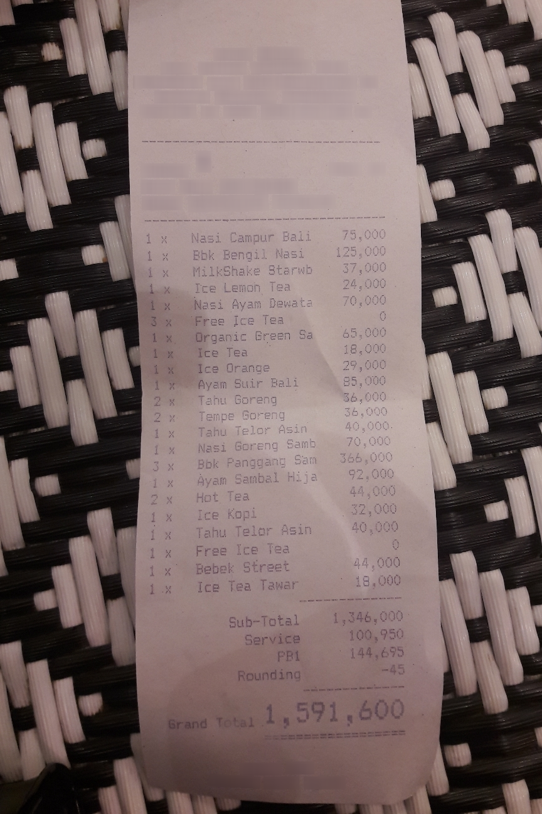

# Finetune Gemma3

This document explains how to finetune Gemma3 using NeMo Automodel. It outlines key operations, including initiating SFT and PEFT-LoRA runs and managing experiment configurations using YAML.

## Data

### CordV2 Dataset

The [CORD-V2](https://huggingface.co/datasets/naver-clova-ix/cord-v2) (Consolidated Receipt Dataset for Document understanding) is a dataset designed for receipt understanding tasks. It contains receipt images paired with structured JSON ground truth data that includes key-value pairs for various receipt fields like menu items, prices, addresses, and other receipt information.

The dataset is particularly useful for training vision-language models to understand and extract structured information from document images, making it ideal for document parsing and optical character recognition (OCR) tasks.

### Dataset Preprocessing

NeMo Automodel provides built-in preprocessing for the CORD-V2 dataset through the `make_cord_v2_dataset` function. Here's how the preprocessing works:

```python
from nemo_automodel.datasets.vlm.datasets import make_cord_v2_dataset

# Load and preprocess the dataset
dataset = make_cord_v2_dataset(
    path_or_dataset="naver-clova-ix/cord-v2", 
    split="train"
)
```

The preprocessing pipeline performs the following steps:

1. **Load the dataset** using HuggingFace's `datasets` library
2. **Parse JSON ground truth** - Extract structured data from the `ground_truth` field
3. **Convert to conversation format** - Transform the data into a chat-like format suitable for Huggingface Autoprocessor's `apply_chat_template` function:

```python
# Example of the conversation format created
conversation = [
    {
        "role": "user",
        "content": [
            {"type": "image", "image": example["image"]},
            {"type": "text", "text": "Describe this image."},
        ],
    },
    {
        "role": "assistant", 
        "content": [{"type": "text", "text": structured_text}]
    },
]
```

**Note**: If you have your own custom dataset, you need to format it to be HuggingFace compatible with the same conversation structure shown above.

### Collate Functions

NeMo Automodel provides specialized collate functions for different VLM processors. The collate function is responsible for batching examples and preparing them for model input.

Gemma3 models work seamlessly with HuggingFace's `AutoProcessor` and use the default collate function:

```python
processor = AutoProcessor.from_pretrained("google/gemma-3-4b-it")

# For Gemma3, this uses the default collate function
def default_collate_fn(examples: list, processor) -> dict[str, torch.Tensor]:
    batch = processor.apply_chat_template(
        [example["conversation"] for example in examples],
        tokenize=True,
        add_generation_prompt=False,
        return_tensors="pt",
        return_dict=True,
    )
    
    # Create labels for training
    labels = batch["input_ids"].clone()[:, 1:]
    labels = torch.cat([labels, -100 * torch.ones_like(labels[:, :1])], dim=1)
    batch["labels"] = labels
    
    return batch
```

The default collate function:
- Applies the processor's chat template to format conversations
- Tokenizes the text with proper padding
- Processes images and converts them to the appropriate tensor format
- Creates labels for training by shifting input tokens
- Masks special tokens (like image tokens, padding tokens) in the loss calculation

Some models like [Qwen2.5 VL](https://huggingface.co/Qwen/Qwen2.5-VL-3B-Instruct) have their own preprocessing requirements and need custom collate functions. For example, Qwen2.5-VL requires the `qwen_vl_utils.process_vision_info` function for proper image processing:

```python

texts = [processor.apply_chat_template(example["conversation"], tokenize=False) for example in examples]
image_inputs = [process_vision_info(example["conversation"])[0] for example in examples]

batch = processor(
    text=texts,
    images=image_inputs,
    padding=True,
    return_tensors="pt",
)

```

To use a custom collate function, specify it in your YAML configuration:

```yaml
dataloader:
  _target_: torchdata.stateful_dataloader.StatefulDataLoader
  batch_size: 1
  collate_fn:
    _target_: nemo_automodel.datasets.vlm.collate_fns.qwen2_5_collate_fn
```

## Run Finetune Script

The VLM fine-tuning functionality is provided through [`recipes/vlm/finetune.py`](../../recipes/vlm/finetune.py).

### Configuration System

NeMo Automodel uses a flexible configuration system that combines YAML configuration files with command-line overrides. This allows you to maintain base configurations while easily experimenting with different parameters.

#### Basic Usage

The simplest way to run fine-tuning is with a YAML configuration file:

```bash
uv run recipes/vlm/finetune.py --config recipes/vlm/gemma_3_vl_3b_cord_v2.yaml
```

#### Command Line Overrides

You can override any configuration parameter using dot-notation without modifying the YAML file:

```bash
uv run recipes/vlm/finetune.py \
    --config recipes/vlm/gemma_3_vl_3b_cord_v2.yaml \
    --step_scheduler.ckpt_every_steps 50 \
    --step_scheduler.max_steps 2000 \
    --optimizer.lr 2e-5 \
    --rng.seed 1234
```

### Model Freezing Configuration

NeMo Automodel provides parameter freezing to control which parts of the model are trainable during fine-tuning. This is particularly important for VLMs where you may want to preserve pre-trained visual representations while adapting the language model.

The freezing configuration allows you to selectively freeze different model components:

```yaml
freeze_config:
  freeze_embeddings: true        # Freeze token embeddings
  freeze_vision_tower: true      # Freeze vision encoder (recommended for VLMs)
  freeze_audio_tower: true       # Freeze audio encoder (for multimodal models)
  freeze_language_model: false   # Allow language model adaptation
```

### Parameter Efficient Fine-Tuning

For memory-efficient training, you can use LoRA (Low-Rank Adaptation) instead of full fine-tuning. NeMo Automodel provides a dedicated PEFT configuration:

```bash
uv run recipes/vlm/finetune.py --config recipes/vlm/gemma_3_vl_3b_cord_v2_peft.yaml
```

The LoRA configuration excludes vision components from adaptation to preserve pre-trained visual representations:

```yaml
peft:
  peft_fn: nemo_automodel._peft.lora.apply_lora_to_linear_modules
  match_all_linear: False
  exclude_modules:  # exclude all vision modules and lm_head
    - "*vision_tower*"
    - "*vision*" 
    - "*visual*"
    - "*image_encoder*"
    - "*lm_head*"
  dim: 8
  alpha: 32
  use_triton: True
```

### Single GPU Training

For single GPU training, simply run the script directly:

```bash
uv run recipes/vlm/finetune.py --config recipes/vlm/gemma_3_vl_3b_cord_v2.yaml
```

The script will automatically:
- Load the specified model (e.g., `google/gemma-3-4b-it`)
- Apply the configured dataset preprocessing
- Set up the optimizer and loss function
- Begin training with the specified parameters

### Multi-GPU Training

For multi-GPU training, use `torchrun` to launch distributed training:

```bash
uv run torchrun --nproc-per-node=2 recipes/vlm/finetune.py \
    --config recipes/vlm/gemma_3_vl_3b_cord_v2.yaml
```

### Checkpointing

We allow training state checkpointing to be done in either [Safetensors](https://huggingface.co/docs/safetensors/en/index) or [PyTorch DCP](https://docs.pytorch.org/tutorials/recipes/distributed_checkpoint_recipe.html) format.

```yaml
checkpoint:
  enabled: true
  checkpoint_dir: vlm_checkpoints/
  model_save_format: torch_save  # or "safetensors"
  save_consolidated: false
```

#### Weights & Biases Integration
Enable W&B logging by setting your API key and configuring the logger:

```bash
export WANDB_API_KEY=<YOUR_WANDB_API_KEY>
```

Then add W&B configuration to your YAML file:
```yaml
wandb:
  project: nemo_automodel_vlm
  entity: your_entity
  name: gemma3_cord_v2_experiment
  save_dir: ./wandb_logs
```

## Prediction

After fine-tuning your Gemma3 model, you can use it for inference on new image-text tasks.

### Generation Script

The inference functionality is provided through [`recipes/vlm/generate.py`](../../recipes/vlm/generate.py), which supports loading fine-tuned checkpoints and performing image-text generation.

#### Basic Usage

```bash
uv run recipes/vlm/generate.py \
    --checkpoint-path /path/to/checkpoint \
    --prompt "Describe this image." \
    --image /path/to/image.jpg
```

The output can be `text`(default) or `json`, optionally writing to file.

For models trained on CORD-V2, you can perform structured document analysis.

```bash
uv run recipes/vlm/generate.py \
    --checkpoint-path vlm_checkpoints/epoch_0_step_200 \
    --prompt "Describe the image" \
    --image receipt.png \
    --max-new-tokens 200 \
    --output-format json
```
For input image as below



You should be able to see model output similar to the following:

```
<s_total><s_total_price>1,591,600</s_total_price></s_total><s_sub_total><s_subtotal_price>1,346,000</s_subtotal_price><s_service_price>100,950</s_service_price><s_tax_price>144,695</s_tax_price><s_subtotal_price>-45</s_subtotal_price></s_sub_total><s_menu><s_unitprice>75,000</s_unitprice><s_price>75,000</s_price><s_nm>Nasi Campur Bali</s_nm><s_cnt>1x</s_cnt>
```