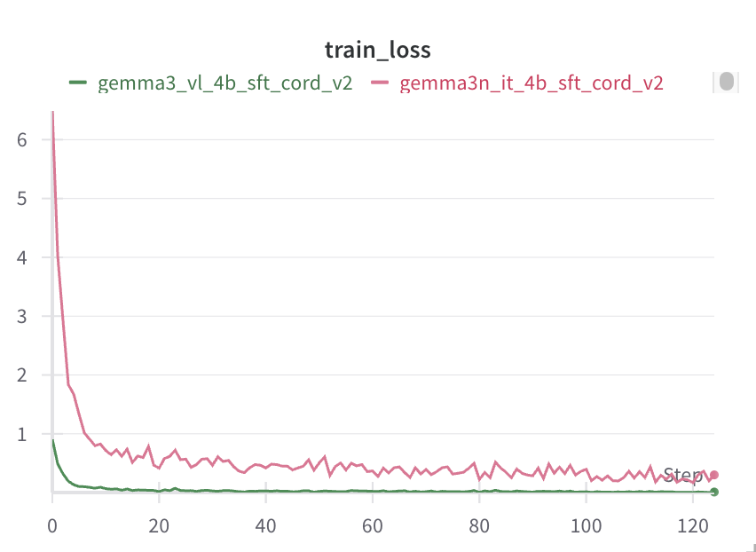

# Finetune Gemma3 and Gemma 3n

This document explains how to finetune Gemma3 and Gemma3n using NeMo Automodel. It outlines key operations, including initiating SFT and PEFT-LoRA runs and managing experiment configurations using YAML. 

To set up your environment to run NeMo Automodel, follow the [installatallation guide](../../README.md#-install-nemo-automodel).

## Data

### CordV2 Dataset

The [CORD-V2](https://huggingface.co/datasets/naver-clova-ix/cord-v2) (Consolidated Receipt Dataset for Document understanding) is a dataset designed for receipt understanding tasks. It contains receipt images paired with structured JSON ground truth data that includes key-value pairs for various receipt fields like menu items, prices, addresses, and other receipt information.

The dataset is particularly useful for training vision-language models to understand and extract structured information from document images, making it ideal for document parsing and optical character recognition (OCR) tasks.

### Dataset Preprocessing

NeMo Automodel provides built-in preprocessing for the CORD-V2 dataset through the `make_cord_v2_dataset` function. Here's how the preprocessing works:

```python
from nemo_automodel.datasets.vlm.datasets import make_cord_v2_dataset

# Load and preprocess the dataset
dataset = make_cord_v2_dataset(
    path_or_dataset="naver-clova-ix/cord-v2", 
    split="train"
)
```

The preprocessing pipeline performs the following steps:

1. **Load the dataset** using HuggingFace's `datasets` library
2. **Parse JSON ground truth** - Extract structured data from the `ground_truth` field
3. **Convert to Huggingface message list format** - Transform the data into a chat-like format suitable for Huggingface Autoprocessor's `apply_chat_template` function:

```python
# Example of the conversation format created
conversation = [
    {
        "role": "user",
        "content": [
            {"type": "image", "image": example["image"]},
            {"type": "text", "text": "Describe this image."},
        ],
    },
    {
        "role": "assistant", 
        "content": [{"type": "text", "text": structured_text}]
    },
]
```

### Collate Functions

NeMo Automodel provides specialized collate functions for different VLM processors. The collate function is responsible for batching examples and preparing them for model input.

Both Gemma3 and Gemma3n models work seamlessly with HuggingFace's `AutoProcessor` and use the default collate function:

```python
processor = AutoProcessor.from_pretrained("google/gemma-3-4b-it")
# For Gemma3n, get processor: 
# processor = AutoProcessor.from_pretrained("google/gemma-3n-e4b-it")

# For Gemma3 and Gemma3n, use the default collate function
def default_collate_fn(examples: list, processor) -> dict[str, torch.Tensor]:
    batch = processor.apply_chat_template(
        [example["conversation"] for example in examples],
        tokenize=True,
        add_generation_prompt=False,
        return_tensors="pt",
        return_dict=True,
    )
    
    labels = batch["input_ids"].clone()[:, 1:]
    labels = torch.cat([labels, -100 * torch.ones_like(labels[:, :1])], dim=1)
    batch["labels"] = labels
    loss_mask = create_batch_loss_masks(
        batch["input_ids"], processor, start_of_response_token=start_of_response_token
    )
    batch["loss_mask"] = loss_mask
    
    return batch
```

The default collate function:
- Applies the processor's chat template to format conversations
- Tokenizes the text with proper padding
- Processes images and converts them to the appropriate tensor format
- Creates labels for training by shifting input tokens
- Masks special tokens and prompts, only answer tokens are taken into loss calculation

### Custom Datasets and Preprocessing

If you are using a custom dataset with a model that has an Hugging Face `AutoProcessor` supporting the `apply_chat_template` method, you will need to convert your data into the Hugging Face message list format expected by `apply_chat_template`.
We provide [examples](../../nemo_automodel/datasets/vlm/datasets.py) demonstrating how to perform this conversion.

Some models, such as [Qwen2.5 VL](https://huggingface.co/Qwen/Qwen2.5-VL-3B-Instruct) have specific preprocessing requirements and require custom collate functions. For instance, Qwen2.5-VL uses the `qwen_vl_utils.process_vision_info` function to process images:

```python

texts = [processor.apply_chat_template(example["conversation"], tokenize=False) for example in examples]
image_inputs = [process_vision_info(example["conversation"])[0] for example in examples]

batch = processor(
    text=texts,
    images=image_inputs,
    padding=True,
    return_tensors="pt",
)

```
If your dataset requires custom preprocessing logic, you can define a custom collate function. To use it, specify the function in your YAML configuration:

```yaml
dataloader:
  _target_: torchdata.stateful_dataloader.StatefulDataLoader
  batch_size: 1
  collate_fn:
    _target_: nemo_automodel.datasets.vlm.collate_fns.qwen2_5_collate_fn
```

We provide [example custom collate functions](../../nemo_automodel/datasets/vlm/collate_fns.py) that you can use as references for your implementation.

## Run Finetune Script

The VLM fine-tuning functionality is provided through [`recipes/vlm/finetune.py`](../../recipes/vlm/finetune.py).

### Configuration System

NeMo Automodel uses a flexible configuration system that combines YAML configuration files with command-line overrides. This allows you to maintain base configurations while easily experimenting with different parameters.

The simplest way to run fine-tuning is with a YAML configuration file. We provide configs for both Gemma3 and Gemma3n.

#### Run Gemma3 finetuning
* **single GPU**

```bash
uv run recipes/vlm/finetune.py --config recipes/vlm/gemma_3_vl_3b_cord_v2.yaml
```
* **Multi GPU**

```
uv run torchrun --nproc-per-node=2 recipes/vlm/finetune.py \
    --config recipes/vlm/gemma_3_vl_3b_cord_v2.yaml
```
#### Run Gemma3n finetuning
* **Single GPU**

```bash
uv run recipes/vlm/finetune.py --config recipes/vlm/gemma_3n_vl_4b_cord_v2.yaml
```

* **Multi GPU**

```bash
uv run torchrun --nproc-per-node=2 --config recipes/vlm/gemma_3n_vl_4b_cord_v2.yaml
```

The training loss should look similar to the example below:



*Figure: Training loss curve showing convergence during finetuning.*

#### Command Line Overrides

You can override any configuration parameter using dot-notation without modifying the YAML file:

```bash
uv run recipes/vlm/finetune.py \
    --config recipes/vlm/gemma_3_vl_3b_cord_v2.yaml \
    --step_scheduler.ckpt_every_steps 100 \
    --step_scheduler.max_steps 1000 \
    --optimizer.lr 2e-5 \
    --rng.seed 1234
```

### Model Freezing Configuration

NeMo Automodel supports parameter freezing to control which parts of a model remain trainable during fine-tuning. This is especially useful for VLMs, where you may want to retain the pre-trained visual and audio encoder while adapting only the language model components.

With the freezing configuration, you can selectively freeze specific parts of the model to suit your training objectives:

```yaml
freeze_config:
  freeze_embeddings: true        # Freeze embeddings
  freeze_vision_tower: true      # Freeze vision encoder (recommended for VLMs)
  freeze_audio_tower: true       # Freeze audio encoder (for multimodal models)
  freeze_language_model: false   # Allow language model adaptation
```

### Parameter Efficient Fine-Tuning

For memory-efficient training, you can use LoRA (Low-Rank Adaptation) instead of full finetuning. NeMo Automodel provides a dedicated PEFT recipe for gemma3:

To run PEFT with Gemma3:
```bash
uv run recipes/vlm/finetune.py --config recipes/vlm/gemma_3_vl_3b_cord_v2_peft.yaml
```

The LoRA configuration excludes vision and audio components from adaptation to preserve pre-trained visual representations:

```yaml
peft:
  peft_fn: nemo_automodel._peft.lora.apply_lora_to_linear_modules
  match_all_linear: False
  exclude_modules:  # exclude all vision and audio modules and lm_head
    - "*vision_tower*"
    - "*vision*" 
    - "*visual*"
    - "*audio*"
    - "*image_encoder*"
    - "*lm_head*"
  dim: 8
  alpha: 32
  use_triton: True
```

### Checkpointing

We allow training state checkpointing to be done in either [Safetensors](https://huggingface.co/docs/safetensors/en/index) or [PyTorch DCP](https://docs.pytorch.org/tutorials/recipes/distributed_checkpoint_recipe.html) format.

```yaml
checkpoint:
  enabled: true
  checkpoint_dir: vlm_checkpoints/
  model_save_format: torch_save  # or "safetensors"
  save_consolidated: false
```

#### Weights & Biases Integration
Enable W&B logging by setting your API key and configuring the logger:

```bash
export WANDB_API_KEY=<YOUR_WANDB_API_KEY>
```

Then add W&B configuration to your YAML file:
```yaml
wandb:
  project: nemo_automodel_vlm
  entity: your_entity
  name: gemma3_cord_v2_experiment
  save_dir: ./wandb_logs
```

## Inference

After fine-tuning your Gemma3 or Gemma3n model, you can use it for inference on new image-text tasks.

### Generation Script

The inference functionality is provided through [`recipes/vlm/generate.py`](../../recipes/vlm/generate.py), which supports loading fine-tuned checkpoints and performing image-text generation.

#### Basic Usage

```bash
uv run recipes/vlm/generate.py \
    --checkpoint-path /path/to/checkpoint \
    --prompt "Describe this image." \
    --base-model google/gemma-3-4b-it \
    --image /path/to/image.jpg
```

The output can be `text`(default) or `json`, optionally writing to file.

For models trained on CORD-V2, you can load the trained checkpoint and generate output using the following command.

```bash
uv run recipes/vlm/generate.py \
    --checkpoint-path vlm_checkpoints/epoch_0_step_200 \
    --prompt "Describe the image" \
    --base-model google/gemma-3-4b-it
    --image receipt.png
```

When checkpoints are saved from PEFT training, they contain only the adapter weights. To use them for generation, you need to specify the PEFT configuration.
Run the following command to load and generate from adapters trained on CORD-V2:

```bash
uv run recipes/vlm/generate.py \
    --checkpoint-path peft_vlm_checkpoints/epoch_0_step_200/ \
    --prompt="describe this image" \
    --image-url=receipt.png \
    --base-model google/gemma-3-4b-it \
    --is-peft \
    --peft-exclude-modules *vision_tower* *vision* *visual* *audio* *image_encoder* *lm_head*
```
