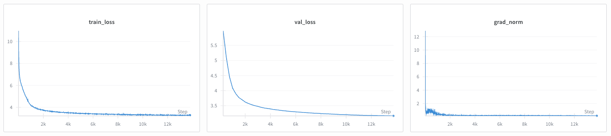

## Introduction

Pretraining builds a base large language model (LLM) by training a randomly initialized model to predict the next token across massive, unlabeled datasets.

Robust pretraining establishes a foundation of linguistic competence and world knowledge that scales with data, parameters, and compute. This base model then serves as the necessary starting point for later fine-tuning or domain-specific adaptation.

NeMo AutoModel provides an end-to-end recipe to run LLM pretraining with Hugging Face–native models and Megatron-Core style datasets.

## Model and Dataset Context

In this guide, we pretrain OpenAI’s `GPT2-124M` model on a FineWeb-Edu subset of 10 billion tokens.

### About the FineWeb-Edu Dataset

[FineWeb-Edu](https://huggingface.co/datasets/HuggingFaceFW/fineweb-edu) is a dataset consisting of 1.3T tokens of educational web pages filtered from the larger [FineWeb](https://huggingface.co/datasets/HuggingFaceFW/fineweb) dataset. The educational web pages were filtered from the main dataset using a fine-tuned [BERT](https://huggingface.co/docs/transformers/en/model_doc/bert)-like classifier. Further reading on the filtering process can be found [here](https://huggingface.co/spaces/HuggingFaceFW/blogpost-fineweb-v1).

Here’s a glimpse of what the data looks like:
```json
{
    "id": "<urn:uuid:673b1bf6-2c30-40ae-992b-c387d00a836a>",
    "dump": "CC-MAIN-2013-20",
    "text": "No. 24; Updated March 2011
    Click here to download and print a PDF version of this document.
    Parents are usually the first to recognize that their child has a problem with emotions or behavior. Still, the decision to seek professional help can be difficult and painful for a parent. The first step is to gently try to talk to the child. An honest open talk about feelings can often help. Parents may choose to consult with the child's physicians, teachers, members of the clergy, or other adults who know the child well. These steps may resolve the problems for the child and family.
    Following are a few signs which may indicate that a child and adolescent psychiatric evaluation will be useful ...",
    "url": "https://www.aacap.org/AACAP/Families_and_Youth/Facts_for_Families/FFF-Guide/When-to-Seek-Help-for-Your-Child-024.aspx",
    "date": null,
    "file_path": "s3://commoncrawl/crawl-data/CC-MAIN-2013-20/segments/1368696381249/warc/CC-MAIN-20130516092621-00000-ip-10-60-113-184.ec2.internal.warc.gz",
    "language": "en",
    "language_score": 0.927742,
    "token_count": 755,
    "score": 3.375,
    "int_score": 3,
}
```

#### Download the FineWeb-Edu Dataset

For this guide, we use the FineWeb-Edu 10BT sample — a collection of approximately 10 billion tokens randomly drawn from the full FineWeb-Edu dataset. To prepare the data, run the following commands:

```bash
# run this inside the AutoModel directory

git clone https://github.com/facebookresearch/lingua.git
uv venv lingua/.venv
source lingua/.venv/bin/activate
uv pip install -r lingua/requirements.txt
MEMORY_GB=16
DATA_DIR=./fineweb_edu
python lingua/setup/download_prepare_hf_data.py fineweb_edu_10bt "$MEMORY_GB" --data_dir "$DATA_DIR" --seed 42 --nchunks 1
```
Set `MEMORY_GB` to the amount of system memory allocated to `terashuf` (the tool used for sample shuffling), and set `DATA_DIR` to the root directory where the data will be stored. For example:
```bash
python lingua/setup/download_prepare_hf_data.py fineweb_edu_10bt 16 --data_dir ./fineweb_edu --seed 42 --nchunks 1
```

The expected directory structure is as follows:

```bash
$ tree fineweb_edu/
fineweb_edu/
├── fineweb_edu_10bt
│   ├── datatrove
│   │   ├── completions
│   │   │   ├── 00000
│   │   │   ├── 00001
│   │   │   ├── 00002
│   │   │   ├── 00003
│   │   │   ├── 00004
│   │   │   ├── 00005
│   │   │   │   ...
│   │   │   └── 00063
│   │   ├── executor.json
│   │   ├── logs
│   │   │   ├── task_00000.log
│   │   │   ├── task_00001.log
│   │   │   ├── task_00002.log
│   │   │   ├── task_00003.log
│   │   │   ├── task_00004.log
│   │   │   ├── task_00005.log
│   │   │   │   ...
│   │   │   └── task_00063.log
│   │   ├── stats
│   │   │   ├── 00000.json
│   │   │   ├── 00001.json
│   │   │   ├── 00002.json
│   │   │   ├── 00003.json
│   │   │   ├── 00004.json
│   │   │   ├── 00005.json
│   │   │   │   ...
│   │   │   └── 00063.json
│   │   └── stats.json
│   ├── fineweb_edu_10bt.chunk.00000.jsonl
│   │   ...
│   ├── fineweb_edu_10bt.chunk.00013.jsonl
│   ├── sample
│   │   └── 10BT
│   │       ├── 000_00000.parquet
│   │       │   ...
│   │       └── 013_00000.parquet
│   └── terashuf
│       ├── LICENSE
│       ├── Makefile
│       ├── README.md
│       ├── terashuf
│       └── terashuf.cc
└── fineweb_edu_10bt_shuffled
    ├── fineweb_edu_10bt.chunk.00.jsonl
    └── fineweb_edu_10bt.val.jsonl
```

## Preprocess to a Megatron Core Dataset
NeMo AutoModel provides tooling to perform the task of tokenizing and saving in the Megatron Core dataset format. You can use it as follows:

```bash
uv run tools/preprocess_megatron_dataset.py --input "fineweb_edu/fineweb_edu_10bt/fineweb_edu_10bt.chunk.*.jsonl" --json-keys text --output-prefix processed_data --output-path fineweb_edu/megatron_gpt2/ --workers 8 --pretrained-model-name-or-path openai-community/gpt2 --append-eod
```

The directory should look like this:
```bash
$ tree fineweb_edu/megatron_gpt2/
fineweb_edu/megatron_gpt2/
├── processed_data_0_text_document.bin
├── processed_data_0_text_document.idx
├── processed_data_10_text_document.bin
├── processed_data_10_text_document.idx
├── processed_data_11_text_document.bin
├── processed_data_11_text_document.idx
├── processed_data_12_text_document.bin
├── processed_data_12_text_document.idx
├── processed_data_13_text_document.bin
├── processed_data_13_text_document.idx
├── processed_data_1_text_document.bin
├── processed_data_1_text_document.idx
├── processed_data_2_text_document.bin
├── processed_data_2_text_document.idx
├── processed_data_3_text_document.bin
├── processed_data_3_text_document.idx
├── processed_data_4_text_document.bin
├── processed_data_4_text_document.idx
├── processed_data_5_text_document.bin
├── processed_data_5_text_document.idx
├── processed_data_6_text_document.bin
├── processed_data_6_text_document.idx
├── processed_data_7_text_document.bin
├── processed_data_7_text_document.idx
├── processed_data_8_text_document.bin
├── processed_data_8_text_document.idx
├── processed_data_9_text_document.bin
└── processed_data_9_text_document.idx

1 directory, 28 files
```

<Tip>
Replace `--workers` with the amount of CPU cores you'd like to use to tokenize in parallel.

</Tip>

## Use a Recipe for Pretraining

This example demonstrates how to perform pretraining on a large language model using NVIDIA's NeMo AutoModel library. We use the LLM [training recipe](https://github.com/NVIDIA-NeMo/Automodel/blob/main/nemo_automodel/recipes/llm/train_ft.py), specifically `TrainFinetuneRecipeForNextTokenPrediction`, which orchestrates the pretraining process — including loading, dataset preparation, optimizer setup, distributed training, checkpointing, and logging.

### What is a Recipe?

A recipe in NeMo AutoModel is a **self-contained orchestration module** that wires together all
components needed to perform a specific task (e.g., pretraining).
Think of it as the equivalent of a Trainer class, but highly modular, stateful, and reproducible.

The `TrainFinetuneRecipeForNextTokenPrediction` class is one such recipe. It inherits from `BaseRecipe` and implements:

- `setup()`: builds all training components from the config

- `run_train_validation_loop()`: executes training + validation steps

- Additional responsibilities: Checkpoint handling, logging, and RNG setup.

### Recipe Config Example

Below is a complete configuration based on `examples/llm_pretrain/megatron_pretrain_gpt2.yaml`:

```yaml
# Copyright (c) 2025, NVIDIA CORPORATION.  All rights reserved.
#
# Licensed under the Apache License, Version 2.0 (the "License");
# you may not use this file except in compliance with the License.
# You may obtain a copy of the License at
#
#     http://www.apache.org/licenses/LICENSE-2.0
#
# Unless required by applicable law or agreed to in writing, software
# distributed under the License is distributed on an "AS IS" BASIS,
# WITHOUT WARRANTIES OR CONDITIONS OF ANY KIND, either express or implied.
# See the License for the specific language governing permissions and
# limitations under the License.

# To run this recipe, please use the following command:
# automodel your_pretraining_config.yaml --nproc-per-node 8
# Adjust --nproc-per-node to the number of GPUs available on your host machine.

recipe: TrainFinetuneRecipeForNextTokenPrediction

# The model section is responsible for configuring the model we want to finetune.
# Since we want to use the GPT2-124M model, we pass `openai-community/gpt2` to the
# `pretrained_model_name_or_path` option.
model:
  _target_: nemo_automodel.NeMoAutoModelForCausalLM.from_config
  config:
    _target_: transformers.AutoConfig.from_pretrained
    pretrained_model_name_or_path: openai-community/gpt2

# As mentioned earlier, we are using the FineWeb-Edu dataset. NeMo AutoModel provides the MegatronPretraining
# class which prepares the dataset by loading, packing, and shuffling. We use the "train" split for
# training.
dataset:
  _target_: nemo_automodel.components.datasets.llm.megatron_dataset.MegatronPretraining
  paths: fineweb_edu/megatron_gpt2/processed_data_*_text_document*  # REPLACE THIS
  index_mapping_dir: fineweb_edu/megatron_gpt2/mapping_dir  # REPLACE THIS
  tokenizer:
    _target_: nemo_automodel._transformers.auto_tokenizer.NeMoAutoTokenizer.from_pretrained
    pretrained_model_name_or_path: openai-community/gpt2
  seq_length: 1024
  split: "0.99, 0.01, 0.00"  # train, validation, test
  splits_to_build: "train"  # has to be one of train, validation, test

dataloader:
  _target_: torchdata.stateful_dataloader.StatefulDataLoader
  collate_fn: torch.utils.data.default_collate
  dataloader_type: "single"  # or "cyclic"

# Similarly, for validation we use the "validation" split
validation_dataset:
  _target_: nemo_automodel.components.datasets.llm.megatron_dataset.MegatronPretraining
  paths: fineweb_edu/megatron_gpt2/processed_data_*_text_document*  # REPLACE THIS
  index_mapping_dir: fineweb_edu/megatron_gpt2/mapping_dir  # REPLACE THIS
  tokenizer:
    _target_: nemo_automodel._transformers.auto_tokenizer.NeMoAutoTokenizer.from_pretrained
    pretrained_model_name_or_path: openai-community/gpt2
  seq_length: 1024
  split: "0.99, 0.01, 0.00"  # train, validation, test
  splits_to_build: "validation"  # has to be one of train, validation, test
  num_val_samples: 1024

step_scheduler:
  global_batch_size: 512
  local_batch_size: 32
  ckpt_every_steps: 1000 # checkpoints state every 1000 steps
  val_every_steps: 250  # validates every 250 steps
  num_epochs: 1
  max_steps: 18500

dist_env:
  backend: nccl
  timeout_minutes: 1

seed: 1111

checkpoint:
  enabled: true
  checkpoint_dir: checkpoints/
  model_save_format: torch_save # torch_save or safetensors
  save_consolidated: false # Sharded torch-save checkpoints; use the DCP-to-HF export script when HF weights are needed.

# For distributed processing, we use FSDP2.
distributed:
  strategy: fsdp2
  dp_size: null
  dp_replicate_size: null  # dp_shard_size = dp_size / dp_replicate_size when set. For DDP use strategy: ddp.
  tp_size: 1
  cp_size: 1
  sequence_parallel: false

loss_fn:
  _target_: nemo_automodel.components.loss.masked_ce.MaskedCrossEntropy

validation_dataloader:
  _target_: torchdata.stateful_dataloader.StatefulDataLoader
  collate_fn: torch.utils.data.default_collate
  dataloader_type: "single"

# We will use the standard AdamW optimizer, but you can specify any optimizer you want, by changing
# the import path using the _target_ option.
optimizer:
  _target_: torch.optim.AdamW
  betas: [0.9, 0.95]
  lr: 0.0006
  weight_decay: 0.1

# We will use a cosine LR schedule with 700 warm-up steps.
# This means the LR will linearly increase to a maximum of 6e-4, after which
# it will decay to 0 over the course of training.
lr_scheduler:
  lr_decay_style: cosine
  lr_warmup_steps: 700
  min_lr: 0.0

# Uncomment and configure for W&B logging
# wandb:
#   project: <your_wandb_project>
#   entity: <your_wandb_entity>
#   name: <your_wandb_exp_name>
#   dir: <your_wandb_save_dir>

```
<Tip>
If you want to add weights to the dataset blends, you can do so by passing in a list. For example, `paths: ["30", "fineweb_edu/megatron_gpt2/processed_data_0_text_document", "70", "fineweb_edu/megatron_gpt2/processed_data_1_text_document"]`.

</Tip>

## Load Large Models
In distributed training, the typical model-loading pipeline has each GPU load the entire model and then retain only the shard it needs. This approach becomes problematic when the model size exceeds the memory capacity of a single GPU. For instance, a 70B-parameter model requires about 140GB of memory for its parameters when using the BF16 data type (2 bytes per parameter). Since most widely used GPUs are limited to 80GB, the full model cannot be directly loaded onto a single device.

In these scenarios, you can pass `is_meta_device: true` in the model config. The model will then be instantiated using [PyTorch's Meta device](https://docs.pytorch.org/docs/stable/meta.html) which loads no data, but stores all other parameter metadata necessary for sharding the model. Once the model is sharded, the model weights will be populated by only loading the weights required by the respective model shard.

## Run the Pretraining Recipe

Assuming you saved, or plan to use, the provided config at `examples/llm_pretrain/megatron_pretrain_gpt2.yaml`:

```bash
uv run automodel examples/llm_pretrain/megatron_pretrain_gpt2.yaml --nproc-per-node 2
```

### Sample Output

You should see step‑wise logs reporting loss, memory usage, and tokens per second. Checkpoints will be saved under the `checkpoints/` directory as configured.

For each training batch, the pretraining recipe logs the current loss, along with current peak memory usage and tokens per second (TPS).

As training progresses, you should observe the model loss beginning to converge. To verify your results, you can compare your convergence curves against the baseline benchmarks provided in the [llm.c repository](https://github.com/karpathy/llm.c/discussions/481).

<Frame caption="Example of GPT-2 training convergence on FineWeb-Edu-10B.">
  
</Frame>
