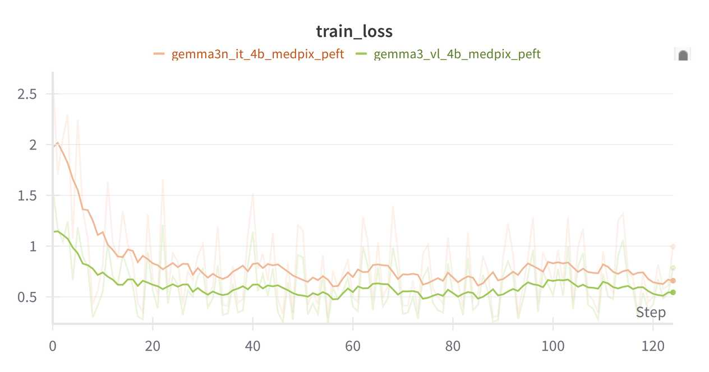
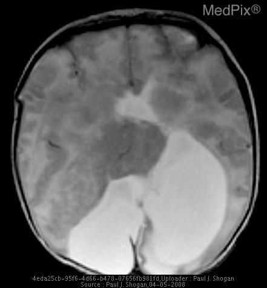

# Fine-Tune Gemma 3n

This guide explains how to fine-tune Gemma 3n using NeMo AutoModel. It covers supervised fine-tuning (SFT), parameter-efficient fine-tuning (PEFT) with Low-Rank Adaptation (LoRA), and experiment configuration using YAML.

To set up your environment to run NeMo AutoModel, follow the [Installation Guide](/get-started/installation).

Before downloading the model or processor, accept the access conditions on the [Gemma 3n model page](https://huggingface.co/google/gemma-3n-e4b-it) and authenticate your environment with a Hugging Face token that has access to the model.

## Data

### MedPix-VQA Dataset

The [MedPix-VQA](https://huggingface.co/datasets/mmoukouba/MedPix-VQA) dataset supports training and evaluating visual question answering (VQA) models in the medical domain. It contains medical images from MedPix paired with questions and answers about image interpretation.

The dataset consists of 20,500 examples with the following structure:
- **Training Set**: 17,420 examples (85%)
- **Validation Set**: 3,080 examples (15%)
- **Columns**: `image_id`, `mode`, `case_id`, `question`, `answer`

### Preprocess the Dataset

NeMo AutoModel provides built-in preprocessing for the MedPix-VQA dataset through the `make_medpix_dataset` function. Here's how the preprocessing works:

```python
from nemo_automodel.components.datasets.vlm.datasets import make_medpix_dataset

# Load and preprocess the dataset
dataset = make_medpix_dataset(
    path_or_dataset="mmoukouba/MedPix-VQA",
    split="train"
)
```

The preprocessing pipeline performs the following steps:

1. **Loads the dataset** using the Hugging Face `datasets` library.
2. **Extracts question-answer pairs** by processing the `question` and `answer` fields from the dataset.
3. **Converts to the Hugging Face message list format** to restructure the data into a chat-style format compatible with the processor's `apply_chat_template` method.

```python
# Example of the conversation format created
conversation = [
    {
        "role": "user",
        "content": [
            {"type": "image", "image": example["image_id"]},
            {"type": "text", "text": example["question"]},
        ],
    },
    {
        "role": "assistant",
        "content": [{"type": "text", "text": example["answer"]}]
    },
]
```

### Use the Collate Functions

NeMo AutoModel provides specialized collate functions for different vision-language model (VLM) processors. The collate function batches examples and prepares them for model input.

The Gemma 3n recipes use the Hugging Face `AutoProcessor` and the default collate function:

```python
from nemo_automodel.components.datasets.vlm.collate_fns import default_collate_fn
from transformers import AutoProcessor

processor = AutoProcessor.from_pretrained("google/gemma-3n-e4b-it")

# For Gemma 3n, call the maintained default collate function.
batch = default_collate_fn([dataset[0]], processor)
```

The default collate function:
- Applies the processor's chat template to convert message lists into model-ready inputs.
- Builds labels from the template's assistant-turn markers and shifts inputs and labels for next-token prediction.
- Masks non-assistant regions with `-100` while retaining assistant content and its closing stop token as training targets.

### Preprocess Custom Datasets

When using a custom dataset with a model whose Hugging Face `AutoProcessor` supports the `apply_chat_template` method, you'll need to convert your data into the Hugging Face message list format expected by the `apply_chat_template`.
We provide [examples](https://github.com/NVIDIA-NeMo/Automodel/blob/main/nemo_automodel/components/datasets/vlm/datasets.py) demonstrating how to perform this conversion.

If your dataset requires custom preprocessing, define a collate function that accepts `examples` and `processor` and returns model inputs and shifted `labels` for next-token prediction. Set `dataloader.collate_fn._target_` to the function's import path. The Gemma 3n recipes configure the default collate function as follows:

```yaml
dataloader:
  _target_: torchdata.stateful_dataloader.StatefulDataLoader
  batch_size: 1
  collate_fn:
    _target_: nemo_automodel.components.datasets.vlm.collate_fns.default_collate_fn
```

We provide [example custom collate functions](https://github.com/NVIDIA-NeMo/Automodel/blob/main/nemo_automodel/components/datasets/vlm/collate_fns.py) that you can use as references for your implementation.

## Run the Fine-Tune Script

Use the `automodel` CLI to launch fine-tuning with a YAML configuration file.

### Apply YAML-Based Configuration

NeMo AutoModel uses a flexible configuration system that combines YAML configuration files with command-line overrides. This allows you to maintain base configurations while easily experimenting with different parameters.

The simplest way to run fine-tuning is with a YAML configuration file. We provide configs for Gemma 3n.

<Note>
Install the optional `vlm` dependencies for the Gemma 3n recipes from the repository root:

```bash
uv sync --frozen --extra vlm
```

If your custom preprocessing requires the media utilities in `vlm-media`, add `--extra vlm-media` to the command.
</Note>

#### Run Gemma 3n Fine-Tuning

* **Single-GPU**

```bash
automodel --nproc-per-node=1 examples/vlm_finetune/gemma3n/gemma3n_vl_4b_medpix.yaml
```

* **Multi-GPU**

```bash
automodel --nproc-per-node=2 examples/vlm_finetune/gemma3n/gemma3n_vl_4b_medpix.yaml
```

#### Override Configuration Parameters

You can override any configuration parameter using dot-notation without modifying the YAML file:

```bash
automodel examples/vlm_finetune/gemma3n/gemma3n_vl_4b_medpix.yaml \
    --step_scheduler.ckpt_every_steps 100 \
    --step_scheduler.max_steps 1000 \
    --optimizer.lr 2e-5 \
    --seed 1234
```

### Configure Model Freezing

NeMo AutoModel supports parameter freezing, allowing you to control which parts of a model remain trainable during fine-tuning. This is especially useful for VLMs, where you may want to preserve the pre-trained visual and audio encoders while adapting only the language model components.

With the freezing configuration, you can selectively freeze specific parts of the model to suit your training objectives:

```yaml
freeze_config:
  freeze_vision_tower: true      # Freeze vision encoder (recommended for VLMs)
  freeze_audio_tower: true       # Freeze audio encoder (for multimodal models)
  freeze_language_model: false   # Allow language model adaptation
```

### Run Parameter-Efficient Fine-Tuning

For memory-efficient training, you can use Low-Rank Adaptation (LoRA) instead of full fine-tuning. NeMo AutoModel provides a dedicated PEFT recipe for Gemma 3n:

To run PEFT with Gemma 3n:

```bash
automodel examples/vlm_finetune/gemma3n/gemma3n_vl_4b_medpix_peft.yaml
```

The recipe's LoRA configuration excludes vision and audio components and the language-model head from adaptation:

```yaml
peft:
  _target_: nemo_automodel.components._peft.lora.PeftConfig
  match_all_linear: False
  exclude_modules:  # Exclude vision and audio modules and lm_head
    - "*vision_tower*"
    - "*vision*"
    - "*visual*"
    - "*image_encoder*"
    - "*lm_head*"
    - "*audio*"
  dim: 8
  alpha: 32
  use_triton: True
```

The orange curve below shows an example Gemma 3n PEFT training run on MedPix-VQA. The green curve is a historical Gemma 3 run included in the plot.



### Configure Checkpointing

Use `model_save_format` to save model weights in [Safetensors](https://huggingface.co/docs/safetensors/en/index) or [PyTorch Distributed Checkpoint (DCP)](https://docs.pytorch.org/tutorials/recipes/distributed_checkpoint_recipe.html) format. Optimizer state is saved with DCP in either case.

```yaml
checkpoint:
  enabled: true
  checkpoint_dir: vlm_checkpoints/
  model_save_format: torch_save  # or "safetensors"
  save_consolidated: false
```

### Integrate Weights & Biases

To enable Weights & Biases (W&B) logging, install the optional `wandb` dependencies from the repository root and set your API key:

```bash
uv sync --frozen --extra vlm --extra wandb
export WANDB_API_KEY="your-wandb-api-key"
```

Then, add the W&B configuration to your YAML file:

```yaml
wandb:
  project: nemo_automodel_vlm
  entity: your_entity
  name: gemma3n_medpix_vqa_experiment
  dir: ./wandb_logs
```

## Run Inference

After fine-tuning your Gemma 3n model, you can use it for inference on new image-text tasks.

### Generation Script

The inference functionality is provided through [`examples/vlm_generate/generate.py`](../../../examples/vlm_generate/generate.py), which supports loading fine-tuned checkpoints and performing image-text generation.

#### Basic Usage

```bash
uv run examples/vlm_generate/generate.py \
    --checkpoint-path /path/to/checkpoint \
    --prompt "Describe this image." \
    --base-model-path google/gemma-3n-e4b-it \
    --image /path/to/image.jpg
```

Use `--output-format text` (the default) or `--output-format json` to select the output format. Add `--output-file /path/to/output` to save the result to a file.

For models trained on MedPix-VQA, load a checkpoint from the recipe's `vlm_checkpoints/` directory. Replace `/path/to/checkpoint` with an existing `epoch_<epoch>_step_<step>` directory, and specify the same base model used during training:

```bash
uv run examples/vlm_generate/generate.py \
    --checkpoint-path /path/to/checkpoint \
    --prompt "What medical condition is shown in this image?" \
    --base-model-path google/gemma-3n-e4b-it \
    --image medical_image.jpg
```

For a PEFT checkpoint, the script detects `model/adapter_model.safetensors`, restores the LoRA configuration from `model/adapter_config.json` and `model/automodel_peft_config.json`, applies LoRA to the base model, and loads the adapter weights automatically. Supply the original base model with `--base-model-path`; no separate PEFT flags are required.

Run the following command to load and generate from adapters trained on MedPix-VQA. Replace `/path/to/peft/checkpoint` with the directory created by your PEFT run; the supplied PEFT recipe also saves under `vlm_checkpoints/`:

```bash
uv run examples/vlm_generate/generate.py \
    --checkpoint-path /path/to/peft/checkpoint \
    --prompt "What medical condition is shown in this image?" \
    --image-url medical_image.jpg \
    --base-model-path google/gemma-3n-e4b-it
```

Given the following image:



And the prompt:

```text
How does the interhemispheric fissure appear in this image?
```

Example Gemma 3n response:

```text
The interhemispheric fissure appears somewhat obscured by the fluid-filled mass.
```
