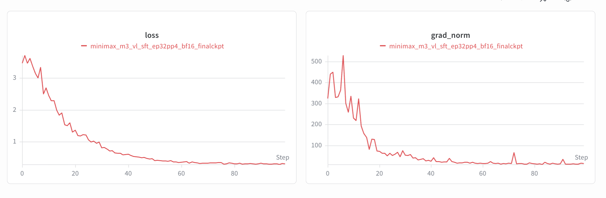
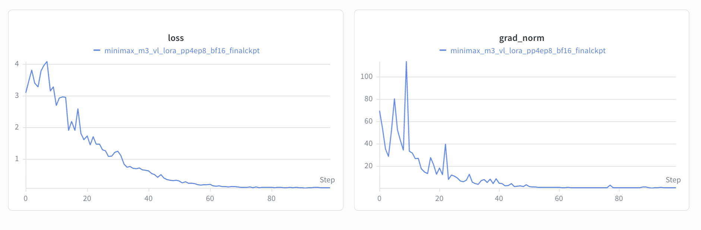

## Introduction

[MiniMaxAI/MiniMax-M3](https://huggingface.co/MiniMaxAI/MiniMax-M3) is MiniMaxAI's mixture-of-experts (MoE) vision-language model combining long-context reasoning, agentic workflows, and creative capabilities in a single platform. The [upstream model card](https://huggingface.co/MiniMaxAI/MiniMax-M3/blob/f0e1c1e04d40177e4673a22097036854f536e9c0/README.md) reports approximately 428B total parameters and 23B active parameters. The multimodal MoE model evolved from MiniMax M2 along three axes — width, attention, and visual grounding.

MiniMaxAI describes MiniMax-M3's long-horizon agentic coding and cowork capabilities in the [upstream model card](https://huggingface.co/MiniMaxAI/MiniMax-M3/blob/f0e1c1e04d40177e4673a22097036854f536e9c0/README.md).

To set up your environment to fine-tune this model with NeMo AutoModel, follow the [installation guide](/get-started/installation).

## Model Overview

### Architecture

- **Model type:** MoE vision-language model with approximately 428B total parameters and 23B active parameters.
- **Language module:** MiniMax-M2.7 backbone with 60 layers (3 dense and 57 MoE), 64 attention heads, 128 experts, block-sparse attention on the MoE layers, and a 1M-token context window.
- **Vision module:**  CLIP-style ViT with 32 layers and dynamic resolution image input from 336×336 up to 2016×2016
- **Fine-tuning precision:** The recipes linked below load BF16 model weights (`model.torch_dtype: bfloat16`).

The [upstream checkpoint configuration](https://huggingface.co/MiniMaxAI/MiniMax-M3/blob/f0e1c1e04d40177e4673a22097036854f536e9c0/config.json) sets `max_position_embeddings` to 1,048,576. The fine-tuning recipes linked below set the data collator's `max_length` to 2,048; the model's context window does not describe the sequence length used by these recipes.

## Data

### Multimodal Supervised Fine-Tuning Data

Use image and video instruction data that matches the target agent workflow. Good candidates include:

- frontend mockup-to-project examples,
- screenshot-debugging conversations,
- structured data-processing tasks with visual context,
- image and video question-answer pairs for bounded task execution.

For a full walkthrough of how multimodal datasets are preprocessed and integrated into NeMo AutoModel, including chat-template conversion and collate functions, see the [Multi-Modal Dataset Guide](/datasets/multi-modal-dataset).

## Launch Training

For Slurm batch jobs, multi-node configuration, and environment variables, follow the [Run on a Cluster](/job-launchers/slurm-cluster) guide. Choose one of the checked-in recipes:

- The [full supervised fine-tuning (SFT) recipe](https://github.com/NVIDIA-NeMo/Automodel/blob/main/examples/vlm_finetune/minimax_m3/minimax_m3_vl_sft_ep32pp4.yaml) provides an example topology of 16 nodes with eight H100 GPUs per node, pipeline parallelism of 4, and expert parallelism of 32.
- The [low-rank adaptation (LoRA) recipe](https://github.com/NVIDIA-NeMo/Automodel/blob/main/examples/vlm_finetune/minimax_m3/minimax_m3_vl_lora_pp4ep8_8node.yaml) uses eight nodes with eight GPUs per node, pipeline parallelism of 4, and expert parallelism of 8.

These are the supplied recipe configurations. Both use BF16 model weights and the HybridEP dispatcher.

The full SFT recipe enables checkpoint saving with `checkpoint.enabled: true`. The LoRA recipe sets `checkpoint.enabled: false` and saves no trained adapters unless you set `checkpoint.enabled` to `true` before launch.

### Prepare the Cluster Environment

- Use an AutoModel container with HybridEP built for multi-node execution (`HYBRID_EP_MULTINODE=1` at build time) and the communication dependencies configured in the repository [Dockerfile](https://github.com/NVIDIA-NeMo/Automodel/blob/main/docker/Dockerfile).
- Clone or mirror the model checkpoint and processor files locally before launching a multi-node run.
- Place the recipe, checkpoint, and Hugging Face cache in a shared directory visible from all nodes and mount it into the container.
- Cache the dataset locally if running with `HF_DATASETS_OFFLINE=1`.
- Configure the `wandb` section in the recipe to record loss, throughput, and memory curves.

### Launch From a Slurm Allocation

Run this skeleton inside an existing allocation with 16 nodes and eight GPUs per node for the full SFT recipe. For LoRA, use the LoRA recipe and an allocation with eight nodes and eight GPUs per node. Replace the image and shared-directory placeholders with your cluster paths. The command starts one `torchrun` process per node, with all nodes joining the same rendezvous.

```bash
export TRANSFORMERS_OFFLINE=1
export HF_HOME=/path/to/shared/hf_cache
export HF_DATASETS_OFFLINE=1
export WANDB_API_KEY=your_wandb_key
export MASTER_ADDR=$(scontrol show hostnames "$SLURM_JOB_NODELIST" | head -n 1)
export MASTER_PORT=29500

srun --output=output.out \
     --error=output.err \
     --nodes="$SLURM_NNODES" \
     --ntasks="$SLURM_NNODES" \
     --ntasks-per-node=1 \
     --gpus-per-node=8 \
     --container-image=/path/to/automodel26.10.image.sqsh \
     --container-mounts=/path/to/shared:/path/to/shared \
     --export=ALL \
     --no-container-mount-home bash -c '
  CUDA_DEVICE_MAX_CONNECTIONS=1 torchrun \
  --nnodes="$SLURM_NNODES" \
  --nproc-per-node=8 \
  --rdzv_id="$SLURM_JOB_ID" \
  --rdzv_backend=c10d \
  --rdzv_endpoint="$MASTER_ADDR:$MASTER_PORT" \
  -m nemo_automodel.cli.app \
  /path/to/shared/minimax_m3_vl_sft_ep32pp4.yaml \
  --model.pretrained_model_name_or_path=/path/to/shared/MiniMax-M3 \
  --processor.pretrained_model_name_or_path=/path/to/shared/MiniMax-M3'
```

## Training Results

The following loss curves were included in the original NeMo AutoModel MiniMax-M3 guide for SFT and LoRA runs. They are historical results; the guide does not record the checkpoint revision or full run configuration for these runs.

**SFT**

<p align="center">
  
</p>

**LoRA**

<p align="center">
  
</p>
