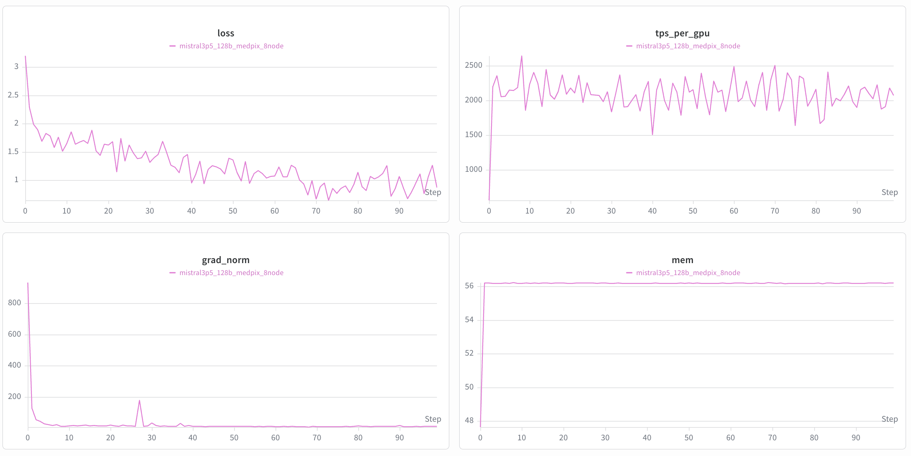

# Fine-Tune Mistral Medium 3.5 VLM

## Introduction

[Mistral Medium 3.5](https://huggingface.co/mistralai) is Mistral AI's
new flagship model. It is a **128B dense** transformer that merges
*Mistral Medium 3.1*, *Magistral Medium*, and *Devstral 2* into a single
checkpoint with a configurable reasoning mode, supports a **256k-token
context window**, and serves the default model in Mistral Vibe and
Le Chat.

The model ships natively in FP8, which
combined with its dense (non-MoE) layout makes it materially smaller to
deploy than comparably-capable MoE systems — full inference fits in a
single H200 node or 2 × H100 nodes, and the recipe in this guide
fine-tunes the full VLM end-to-end on 8 × H100 nodes (64 GPUs).

**Architecture at a glance**

- 88 Ministral-3 decoder layers (hidden 12288, 96 attention heads, 8 KV
  heads, GQA), llama-style RoPE + RMSNorm + SwiGLU MLP.
- Dense — no MoE routing. Compactness vs. MoE peers translates directly
  into smaller per-GPU memory and easier multi-node sharding.
- Pixtral vision tower + multi-modal projector for image inputs.
- FP8 on disk; dequantized to BF16 per local TP shard inside the
  standard DCP load path.

This guide walks you through fine-tuning Mistral Medium 3.5 on a medical
Visual Question Answering task using NVIDIA NeMo AutoModel. You will
learn how to prepare the dataset, launch training on a Slurm cluster,
and inspect the results.

To set up your environment to run NeMo AutoModel, follow the
[installation guide](https://github.com/NVIDIA-NeMo/Automodel#-install-nemo-automodel).

## Data

### MedPix-VQA Dataset

We use the [MedPix-VQA](https://huggingface.co/datasets/mmoukouba/MedPix-VQA)
dataset, a comprehensive medical Visual Question Answering dataset
containing radiological images paired with question-answer pairs for
medical image interpretation.

- **20,500 total examples** (85% train / 15% validation)
- **Columns**: `image_id`, `mode`, `case_id`, `question`, `answer`

For a full walkthrough of how MedPix-VQA is preprocessed and integrated
into NeMo AutoModel — including the chat-template conversion and collate
functions — see the
[Multi-Modal Dataset Guide](https://github.com/NVIDIA-NeMo/Automodel/blob/main/docs/guides/vlm/dataset.md#multi-modal-datasets).

## Launch Training

We provide a ready-to-use recipe at
[`examples/vlm_finetune/mistral3p5/mistral3p5_128b_medpix.yaml`](https://github.com/NVIDIA-NeMo/Automodel/blob/main/examples/vlm_finetune/mistral3p5/mistral3p5_128b_medpix.yaml).
This recipe is configured for **8 nodes × 8 H100-80GB GPUs (64 GPUs total)**
with TP=8, PP=8, DP=1. The vision tower and multi-modal projector are
frozen by default and only the Ministral-3 language model is trained;
flip `freeze_config.freeze_vision_tower: false` to train the vision
side as well.

NeMo AutoModel supports several ways to launch training — via the
AutoModel CLI with Slurm, interactive sessions, `torchrun`, and more.
For full details on all launch options (Slurm batch jobs, multi-node
configuration, environment variables, etc.), see the
[Run on a Cluster](https://github.com/NVIDIA-NeMo/Automodel/blob/main/docs/launcher/slurm.md)
guide.

**Before you start**:

- Hugging Face applies rate limits on downloads. We recommend cloning
  the model repository to your local filesystem beforehand.
- Ensure your Hugging Face cache (`HF_HOME`) is configured and that the
  dataset is already cached locally.
- To enable Weights & Biases logging, set your `WANDB_API_KEY` and
  configure the `wandb` section in the YAML file.

## Training Results

The recipe produces a healthy initial loss aligned with the HF
reference forward on matched samples. On MedPix-VQA the first
optimizer step lands around per-token loss **3.2** and grad-norm
**~930** (clipped to `max_grad_norm=1.0`), descending past 1.8 within
a handful of steps. The HF reference forward (single-sample, FP8
dequantize on-load) on the same first batch produces per-token loss
**3.47**, confirming the distributed forward is numerically
equivalent within bf16 + TP-reduction tolerance.

The training loss curves for Mistral Medium 3.5 fine-tuned on
MedPix-VQA are shown below.

  

