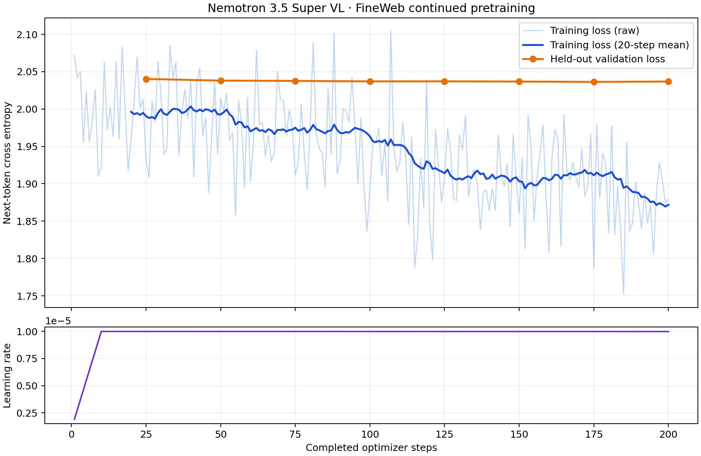

Continue training the language backbone of **Nemotron 3.5 Super VL** on raw
[FineWeb](https://huggingface.co/datasets/HuggingFaceFW/fineweb) text. This guide follows the
setup, training, checkpoint, and results structure of the
[CORD-v2 tutorial](/recipes-e2e-examples/nemotron-3-5-super-vl), using a next-token pretraining
objective and **Megatron indexed `.bin/.idx` data**.

The model is loaded from
`nvidia/NVIDIA-Nemotron-3.5-Super-midtrain-67B-vision-pretrained`. Despite the historical
`67B` in its name, this checkpoint contains approximately 121B parameters. The complete
VL model is retained; its RADIO vision tower and vision projector are frozen and unused
during this text-only run. The language backbone is trained with full-parameter updates,
with no LoRA adapters. The MTP head is disabled.

## What This Run Measures

The recipe uses the first 100,000 documents of one shard in FineWeb's `sample/10BT`
configuration, producing **69,756,226 tokens**, including one EOS/EOD token per document.
This is a bounded continued-pretraining example, not a run over all of FineWeb or the full
10-billion-token sample.

The Megatron loader splits documents into 99,000 training and 1,000 held-out validation
documents before building sample indices. It concatenates document token streams, uses
EOS as the document separator, and samples 4,096-token windows. A window can span multiple
documents. The default GPT dataset does not reset attention or Mamba state at EOS within
a window.

There is no chat template, user/assistant conversation, or assistant-only loss mask.
For tokens `[t0, t1, ..., t4096]`, one training sample has:

```text
input_ids: [t0, t1, ..., t4095]
labels:    [t1, t2, ..., t4096]
loss_mask: [ 1,  1, ...,     1]
```

The model learns to predict all next tokens, including document-ending EOS tokens.
Validation loss is computed on held-out FineWeb text using the same tokenizer and objective.
A lower loss on this sample does not establish improved downstream task accuracy or retained
image understanding.

## Hardware and Run Configuration

| Setting | Value |
|---|---|
| GPUs | 8 nodes × 8 H100 80 GB |
| Parallelism | FSDP2, CP4, EP64, TP1, PP1; DP16 |
| Sequence length | 4,096 |
| Batch | Local batch 1, global batch 32, 2 accumulation microbatches per DP rank |
| Training | 200 measured optimizer steps; configured schedule horizon of 10,000 steps |
| Validation | 128 sequences, every 25 steps |
| Precision and kernels | BF16, TE attention/linear, torch grouped matrix multiplication, DeepEP |
| Optimizer | TE FusedAdam, FP32 master weights, BF16 moments |
| Learning rate | Peak 1e-5, 10-step warmup, cosine decay toward 1e-6 over 10,000 steps |
| Checkpoint | Sharded checkpoint every 100 steps; retain the latest two plus pointer-protected checkpoints |
| Tracking | Online Weights & Biases |

## Step 0 — Set Up the Environment

Run preparation and training in the NeMo AutoModel container on allocated compute nodes.
For a source overlay inside an existing container:

```bash
cd /path/to/Automodel
export PYTHONPATH="$PWD:${PYTHONPATH:-}"

# Install these only if they are absent from the environment.
uv pip install --python "$(command -v python3)" huggingface_hub pyarrow matplotlib wandb
```

The training environment also needs Transformer Engine, DeepEP, `mamba_ssm`,
`causal_conv1d`, and a C++ compiler for the Megatron dataset indexing helper.
The [installation guide](/get-started/installation) describes the complete environment.

Set shared paths accessible from every training node:

```bash
export MODEL=nvidia/NVIDIA-Nemotron-3.5-Super-midtrain-67B-vision-pretrained
export MODEL_REVISION=2a6837af6b67067b5a89ceb73cb6d01dfdc71ea8
export HF_HOME=/path/to/shared/hf_cache
export CPT_DATA_ROOT=/path/to/shared/super35_fineweb
export FINEWEB_DATA_DIR="$CPT_DATA_ROOT/megatron"
mkdir -p "$CPT_DATA_ROOT" "$FINEWEB_DATA_DIR"

export WANDB_ENTITY=Nemo-automodel
export WANDB_PROJECT=huiyingl_workspace
export WANDB_MODE=online
export WANDB_CONSOLE=off
```

Use your own W&B entity and project if needed. Authenticate Hugging Face if the model
requires access. Download the base model once into the shared cache before starting a
multi-node allocation:

```bash
export MODEL_SNAPSHOT=$(python - <<'PY'
import os
from huggingface_hub import snapshot_download

print(snapshot_download(
    os.environ["MODEL"],
    revision=os.environ["MODEL_REVISION"],
    cache_dir=os.path.join(os.environ["HF_HOME"], "hub"),
))
PY
)
```

The base BF16 checkpoint is approximately 232 GiB (249 GB). A full sharded training
checkpoint in this configuration occupies approximately **1.35 TiB**, including
about 227 GiB of model shards and 1.1 TiB of optimizer state. Allow approximately
**6 TiB of additional storage** for two recent checkpoints, a potentially separate
best checkpoint, and a new save in progress.

## Step 1 — Download a Reproducible FineWeb Sample

FineWeb is distributed as Parquet containing a `text` column. The raw download is not yet
Megatron training data. This example pins the dataset revision and takes the first 100,000
rows from `sample/10BT/000_00000.parquet`. The source shard download is about 2.15 GB.

```bash
python - <<'PY'
import hashlib
import json
import os
from pathlib import Path

import pyarrow as pa
import pyarrow.parquet as pq
from huggingface_hub import hf_hub_download
from transformers import AutoTokenizer

root = Path(os.environ["CPT_DATA_ROOT"])
revision = "9bb295ddab0e05d785b879661af7260fed5140fc"
source_name = "sample/10BT/000_00000.parquet"
source = hf_hub_download(
    "HuggingFaceFW/fineweb",
    source_name,
    repo_type="dataset",
    revision=revision,
    local_dir=root / "download",
)

batches, remaining = [], 100_000
for batch in pq.ParquetFile(source).iter_batches(batch_size=10_000, columns=["text", "id"]):
    batch = batch.slice(0, min(remaining, batch.num_rows))
    batches.append(batch)
    remaining -= batch.num_rows
    if remaining == 0:
        break
assert remaining == 0

raw = root / "fineweb_100k.parquet"
table = pa.Table.from_batches(batches)
pq.write_table(table, raw)

# Save only tokenizer assets for the standalone preprocessing tool.
tokenizer = AutoTokenizer.from_pretrained(os.environ["MODEL_SNAPSHOT"], trust_remote_code=True)
tokenizer.save_pretrained(root / "tokenizer")
with raw.open("rb") as handle:
    checksum = hashlib.file_digest(handle, "sha256").hexdigest()

manifest = {
    "dataset": "HuggingFaceFW/fineweb",
    "revision": revision,
    "source_file": source_name,
    "selected_rows": [0, 100000],
    "documents": table.num_rows,
    "tokenizer": os.environ["MODEL"],
    "tokenizer_revision": os.environ["MODEL_REVISION"],
    "vocab_size": len(tokenizer),
    "eos_token_id": tokenizer.eos_token_id,
    "raw_sha256": checksum,
}
(root / "manifest.json").write_text(json.dumps(manifest, indent=2) + "\n")
print(json.dumps(manifest, indent=2))
PY
```

Use this model's tokenizer for preprocessing. Megatron files created for another tokenizer,
including GPT-2 or a different Nemotron checkpoint, are not interchangeable.

## Step 2 — Tokenize into Megatron `.bin/.idx`

Run the repository's existing preprocessing tool. `--append-eod` appends the tokenizer's
EOS token to each document. Do not apply a chat template or split documents into sentences.

```bash
python tools/preprocess_megatron_dataset.py \
  --input "$CPT_DATA_ROOT/fineweb_100k.parquet" \
  --input-type parquet \
  --json-keys text \
  --output-prefix fineweb \
  --output-path "$FINEWEB_DATA_DIR" \
  --pretrained-model-name-or-path "$CPT_DATA_ROOT/tokenizer" \
  --workers 16 \
  --append-eod
```

Expected outputs:

```text
super35_fineweb/
├── manifest.json
├── fineweb_100k.parquet
├── tokenizer/
└── megatron/
    ├── fineweb_0_text_document.bin
    └── fineweb_0_text_document.idx
```

The binary file stores token IDs; the index stores document offsets and lengths. Here the
token IDs use 32 bits because the vocabulary has 131,072 entries. The output is about
267 MiB of token data plus 2 MiB of index metadata. `index_mapping/` is created when
the dataset loader builds deterministic document, sample, and shuffle indices.

Inspect the result before training:

```bash
python - <<'PY'
import hashlib
import json
import os
from pathlib import Path

import numpy as np
import pyarrow.parquet as pq
from transformers import AutoTokenizer
from nemo_automodel.components.datasets.llm.megatron.indexed_dataset import IndexedDataset

root = Path(os.environ["CPT_DATA_ROOT"])
prefix = Path(os.environ["FINEWEB_DATA_DIR"]) / "fineweb_0_text_document"
dataset = IndexedDataset(str(prefix))
tokenizer = AutoTokenizer.from_pretrained(root / "tokenizer")
text = pq.read_table(root / "fineweb_100k.parquet", columns=["text"])["text"][0].as_py()
expected = tokenizer(text).input_ids + [tokenizer.eos_token_id]
assert np.array_equal(dataset[0], expected)
assert len(dataset) == 100_000
token_count = int(dataset.sequence_lengths.sum())
assert token_count == 69_756_226

# Record the derived files so all nodes can use the same verified dataset.
checksums = {}
for suffix in [".bin", ".idx"]:
    path = Path(str(prefix) + suffix)
    with path.open("rb") as handle:
        checksums[path.name] = hashlib.file_digest(handle, "sha256").hexdigest()
manifest_path = root / "manifest.json"
manifest = json.loads(manifest_path.read_text())
manifest["megatron"] = {
    "prefix": str(prefix),
    "documents": len(dataset),
    "tokens_including_eod": token_count,
    "sha256": checksums,
}
manifest_path.write_text(json.dumps(manifest, indent=2) + "\n")
print("documents:", len(dataset))
print("tokens including EOD:", token_count)
print("first document round-trip: passed")
print(json.dumps(manifest["megatron"], indent=2))
PY
```

Expected counts are `100000` documents and `69756226` tokens. The manifest now
records the source dataset revision, tokenizer revision, row selection, and SHA-256
checksums of the indexed training files. Set `FINEWEB_DATA_DIR` to this same shared
directory on every training node.

## Step 3 — Review the Continued-Pretraining YAML

Use
[`nemotron_3_5_super_vl_fineweb_cpt.yaml`](https://github.com/NVIDIA-NeMo/Automodel/blob/main/examples/llm_pretrain/nemotron_3_5_super_vl/nemotron_3_5_super_vl_fineweb_cpt.yaml).

The `TrainFinetuneRecipeForNextTokenPrediction` recipe is also the existing LLM pretraining
entrypoint. Its name does not imply an SFT objective: `MegatronPretraining` supplies raw,
shifted next-token targets. `from_pretrained` loads the existing weights rather than
randomly initializing a model. Architecture registration resolves the causal-LM entrypoint
to the full `NemotronOmniForConditionalGeneration` implementation.

The important data fields are:

```yaml
dataset:
  _target_: nemo_automodel.components.datasets.llm.megatron_dataset.MegatronPretraining
  paths: ${oc.env:FINEWEB_DATA_DIR}/fineweb_0_text_document
  index_mapping_dir: ${oc.env:FINEWEB_DATA_DIR}/index_mapping
  seq_length: 4096
  seed: 1234
  split: "99,1,0"
  splits_to_build: train
```

Both dataset sections in the complete YAML use the same prefix, tokenizer, seed, and split
ratio. The validation section selects `splits_to_build: validation` and fixes
`num_val_samples: 128`. The split is applied to documents before sampling windows, so
train and validation do not share documents. This held-out split is local to the selected
FineWeb sample; FineWeb itself does not supply the validation set used here.

Set `paths` to the common prefix **without** `.bin` or `.idx`. These are Megatron
indexed files, not NanoGPT binary shards. The loader already constructs fixed-length
pretraining sequences, so this YAML does not enable the separate VLM/chat packing pipeline.

Create an effective YAML that pins the model and both training tokenizers to the
downloaded snapshot. Use this file for the launch so preprocessing and training cannot
resolve different revisions:

```bash
export CPT_RECIPE="$PWD/fineweb_cpt_effective.yaml"
python - <<'PY'
import os
from pathlib import Path
import yaml

source = Path("examples/llm_pretrain/nemotron_3_5_super_vl/nemotron_3_5_super_vl_fineweb_cpt.yaml")
config = yaml.safe_load(source.read_text())
snapshot = os.environ["MODEL_SNAPSHOT"]
config["model"]["pretrained_model_name_or_path"] = snapshot
for section in ["dataset", "validation_dataset"]:
    config[section]["tokenizer"]["pretrained_model_name_or_path"] = snapshot
config["wandb"]["enable"] = True
Path(os.environ["CPT_RECIPE"]).write_text(yaml.safe_dump(config, sort_keys=False))
print(os.environ["CPT_RECIPE"])
PY
```

The global batch calculation is:

```text
world size = 8 nodes × 8 GPUs = 64
DP size    = world / (TP × CP × PP) = 64 / 4 = 16
accumulation = global batch / (DP size × local batch) = 32 / (16 × 1) = 2
tokens per optimizer step = 32 × 4096 = 131072
```

The measured results cover **200 completed optimizer steps**, corresponding to
**26,214,400 target-token positions**. Keep `max_steps=10000` when reproducing the
recorded data stream and learning-rate schedule: the Megatron loader builds its sample
indices for that horizon, and the cosine scheduler uses the same horizon after a
10-step warmup. The 200-step curve covers the beginning of this schedule.

The Slurm example below requests a 45-minute allocation as a resource time limit.

## Step 4 — Launch with Slurm and Online W&B

The recipe's example default is `wandb.enable: false`, following the repository's opt-in
convention. **The commands in this tutorial explicitly enable online W&B.**

Create `fineweb_cpt.sub` on the shared filesystem. Adjust the account, shared paths, and
container image to your cluster. The following uses one Slurm task per GPU; do not start
an additional eight-process `torchrun` inside each task.

```bash
#!/usr/bin/env bash
#SBATCH --account=coreai_dlalgo_llm
#SBATCH --partition=batch
#SBATCH --nodes=8
#SBATCH --gpus-per-node=8
#SBATCH --ntasks-per-node=8
#SBATCH --cpus-per-task=16
#SBATCH --mem=0
#SBATCH --exclusive
#SBATCH --time=00:45:00
#SBATCH --job-name=super35-fineweb-cpt
#SBATCH --output=super35-cpt-%j.out
#SBATCH --error=super35-cpt-%j.err
set -euo pipefail

export AUTOMODEL_REPO=/path/to/shared/Automodel
export CPT_RECIPE=/path/to/shared/Automodel/fineweb_cpt_effective.yaml
export HF_HOME=/path/to/shared/hf_cache
export FINEWEB_DATA_DIR=/path/to/shared/super35_fineweb/megatron
export CPT_CHECKPOINT_DIR=/path/to/shared/checkpoints/super35_cpt_${SLURM_JOB_ID}
export WANDB_ENTITY=Nemo-automodel
export WANDB_PROJECT=huiyingl_workspace
export WANDB_MODE=online
export WANDB_CONSOLE=off
export WANDB_RUN_ID=super35cpt${SLURM_JOB_ID}
export MASTER_ADDR=$(scontrol show hostnames "$SLURM_JOB_NODELIST" | head -n1)
export MASTER_PORT=29577
: "${WANDB_API_KEY:?Export WANDB_API_KEY before sbatch}"

srun --kill-on-bad-exit=1 \
  --container-image=/path/to/shared/auto2604.sqsh \
  --container-mounts=/lustre:/lustre \
  --no-container-mount-home \
  bash -c '
    set -euo pipefail
    cd "$AUTOMODEL_REPO"
    export PYTHONPATH="$AUTOMODEL_REPO:${PYTHONPATH:-}"
    export RANK=$SLURM_PROCID LOCAL_RANK=$SLURM_LOCALID WORLD_SIZE=$SLURM_NTASKS
    export HF_HUB_OFFLINE=1 TRANSFORMERS_OFFLINE=1
    export PYTORCH_ALLOC_CONF=expandable_segments:True
    export TOKENIZERS_PARALLELISM=false OMP_NUM_THREADS=8
    python3 examples/llm_pretrain/pretrain.py \
      -c "$CPT_RECIPE" \
      --checkpoint.checkpoint_dir="$CPT_CHECKPOINT_DIR" \
      --wandb.enable=true \
      --wandb.name="super35-fineweb-cpt-${SLURM_JOB_ID}"
  '
```

Submit from the login node after completing data preparation. Set the W&B key in this
submission shell so `sbatch` passes it to the containers. For example:

```bash
read -rsp "W&B API key: " WANDB_API_KEY
export WANDB_API_KEY
sbatch fineweb_cpt.sub
```

The rank-zero log prints the online W&B run URL. On W&B, plot `loss` and `val_loss`
against the optimizer step, with `lr` in a separate panel.

## Step 5 — Inspect the Checkpoint and Resume

The checkpoint directory contains `training.jsonl` and `validation.jsonl` plus saved
training state. The recipe configures a sharded checkpoint every 100 steps. The retention window keeps
the latest two complete checkpoints; a checkpoint protected by a pointer such as
`LOWEST_VAL` can also be retained. Consolidated export is disabled in this recipe.

Select a complete checkpoint referenced by `LATEST`. To create an HF export, run
the selected checkpoint's `model/consolidate.sh` on a suitably sized compute allocation.

Keep the exact launch command with each run. The checkpoint's `config.yaml` records the
source YAML and does not include CLI overrides in the version used here. For the measured
run, those overrides are materialized in a per-run YAML before submission.

Use the original sharded training checkpoint with `checkpoint.restore_from` to resume optimizer,
scheduler, and dataloader state. Add the following override to the per-rank training
command after checking that `LATEST` resolves to a complete checkpoint:

```bash
--checkpoint.restore_from=/path/to/checkpoints/LATEST
```

Keep the tokenizer, dataset prefix and revision, train/validation split, seed, and batch
semantics fixed when resuming training. The optimizer scheduler restores its
checkpointed decay schedule by default: increasing `step_scheduler.max_steps` alone does
not extend the saved learning-rate decay. For this recipe, keep the original 10,000-step
schedule when continuing training.

## Step 6 — Plot and Interpret the Recorded Loss

Export the unsampled training and validation metrics from online W&B. The following
script checks any available local JSONL records against W&B and writes the exported
metrics to a separate plot directory.

Set the measured run's checkpoint directory and W&B run path in your current shell;
variables exported inside the batch job are not carried back to the submission shell.
The following runs on a CPU compute allocation with access to W&B:

```bash
export CPT_CHECKPOINT_DIR=/path/to/shared/checkpoints/super35_cpt_JOB_ID
export CPT_WANDB_RUN=Nemo-automodel/huiyingl_workspace/super35cptJOB_ID
export CPT_PLOT_DIR="$CPT_CHECKPOINT_DIR/plots"
python - <<'PY'
import json
import math
import os
from pathlib import Path
import wandb

root = Path(os.environ["CPT_CHECKPOINT_DIR"])
out = Path(os.environ["CPT_PLOT_DIR"])
out.mkdir(parents=True, exist_ok=True)
run = wandb.Api().run(os.environ["CPT_WANDB_RUN"])
history = list(run.scan_history(page_size=1000))
(out / "wandb_history.jsonl").write_text(
    "".join(json.dumps(row) + "\n" for row in history)
)
for filename, metric in [("training.jsonl", "loss"), ("validation.jsonl", "val_loss")]:
    local_path = root / filename
    local = {
        row["step"]: row
        for row in (
            json.loads(line) for line in
            (local_path.read_text().splitlines() if local_path.exists() else [])
            if line.strip()
        )
    }
    remote = {row["_step"]: row for row in history if row.get(metric) is not None}
    assert remote, f"No {metric} data on W&B yet"
    for step, row in local.items():
        assert step in remote, f"W&B has not uploaded {filename} step {step}; retry after syncing"
        assert math.isclose(row[metric], remote[step][metric], rel_tol=1e-7, abs_tol=1e-7)
    # W&B merges training and validation at the same step. Select unambiguous fields:
    # loss and val_loss remain separate; num_label_tokens/mem can be overwritten by validation.
    merged = []
    for step, row in sorted(remote.items()):
        record = local.get(step, {"step": step, metric: row[metric], "lr": row.get("lr")})
        if metric == "loss":
            record.setdefault("tps", row.get("tps"))
        merged.append(record)
    assert all(math.isfinite(row[metric]) for row in merged)
    if metric == "loss":
        assert [row["step"] for row in merged] == list(range(len(merged)))
    (out / filename).write_text("".join(json.dumps(row) + "\n" for row in merged))
print(run.url)
print("Exported metrics:", out)
PY
```

Allow W&B synchronization to complete before exporting the metrics. Check that the
exported step count matches the training log.

The next script reads the exported metrics and writes a standalone plot and CSV.

```bash
export CPT_CHECKPOINT_DIR=/path/to/shared/checkpoints/super35_cpt_JOB_ID
export CPT_PLOT_DIR="$CPT_CHECKPOINT_DIR/plots"
python - <<'PY'
import csv
import json
import os
from pathlib import Path
import matplotlib
matplotlib.use("Agg")
import matplotlib.pyplot as plt
import numpy as np

root = Path(os.environ["CPT_PLOT_DIR"])
out = root
out.mkdir(parents=True, exist_ok=True)
def read(name):
    return [json.loads(line) for line in (root / name).read_text().splitlines() if line.strip()]
train, valid = read("training.jsonl"), read("validation.jsonl")
steps = np.array([row["step"] + 1 for row in train])
loss = np.array([row["loss"] for row in train])
assert np.isfinite(loss).all()
assert np.isfinite([row["val_loss"] for row in valid]).all()
fig, (ax, lr_ax) = plt.subplots(2, 1, figsize=(10, 6.5), sharex=True,
                               gridspec_kw={"height_ratios": [3, 1]}, constrained_layout=True)
ax.plot(steps, loss, color="#3b82f6", alpha=0.35, linewidth=1, label="Training loss (raw)")
window = min(20, len(train))
ax.plot(steps[window - 1:], np.convolve(loss, np.ones(window) / window, mode="valid"),
        color="#1d4ed8", linewidth=2, label=f"Training loss ({window}-step mean)")
ax.plot([r["step"] + 1 for r in valid], [r["val_loss"] for r in valid],
        "o-", color="#e76f00", linewidth=2, label="Held-out validation loss")
ax.set(ylabel="Next-token cross entropy", title="Nemotron 3.5 Super VL · FineWeb continued pretraining")
ax.legend()
ax.grid(alpha=0.2)
lr_ax.plot(steps, [r["lr"] for r in train], color="#6d28d9")
lr_ax.set(xlabel="Completed optimizer steps", ylabel="Learning rate")
lr_ax.ticklabel_format(axis="y", style="sci", scilimits=(0, 0))
lr_ax.grid(alpha=0.2)
fig.savefig(out / "nemotron-3-5-super-vl-fineweb-cpt-loss.png", dpi=180)
plt.close(fig)
with (out / "fineweb_cpt_metrics.csv").open("w", newline="") as handle:
    fields = ["completed_steps", "training_loss", "validation_loss", "lr", "memory_gib", "tokens_per_second"]
    writer = csv.DictWriter(handle, fieldnames=fields)
    writer.writeheader()
    validation = {r["step"]: r["val_loss"] for r in valid}
    for r in train:
        writer.writerow(dict(zip(fields, [r["step"] + 1, r["loss"], validation.get(r["step"], ""),
                                          r["lr"], r.get("mem", ""), r.get("tps", "")])))
print(out / "nemotron-3-5-super-vl-fineweb-cpt-loss.png")
PY
```

## Measured Results — 200 Steps

The DFW experiment completed **200 optimizer steps** and **8 held-out validation passes**,
processing **26,214,400 target-token positions**.

The [online W&B run](https://wandb.ai/Nemo-automodel/huiyingl_workspace/runs/cpt18614199)
contains all 200 training losses and all eight validation losses. Every value was checked
against the corresponding Slurm log entry within its printed precision. The plot uses
full-precision values exported from unsampled W&B history.



| Measurement | Value |
|---|---|
| Completed optimizer steps | 200 |
| Held-out validation passes | 8 |
| Target-token positions trained | 26,214,400 |
| First / last training loss | 2.071841 / 1.879269 |
| First / last 20-step mean training loss | 1.996266 / 1.871782 |
| First / last held-out validation loss | 2.040317 / 2.036835 |
| Highest sampled total GPU memory | 63.41 GiB |
| Lowest sampled free GPU memory | 15.70 GiB |

The plot uses completed optimizer steps 1–200; raw logs and W&B use steps 0–199.
The blue line averages 20 consecutive training losses. Validation evaluates the same
128 held-out sequences every 25 optimizer steps.

The [metrics CSV](./fineweb_cpt_metrics.csv) contains all 200 training measurements
and the eight validation measurements used in the plot. Full-precision history is also
available from the linked W&B run.
