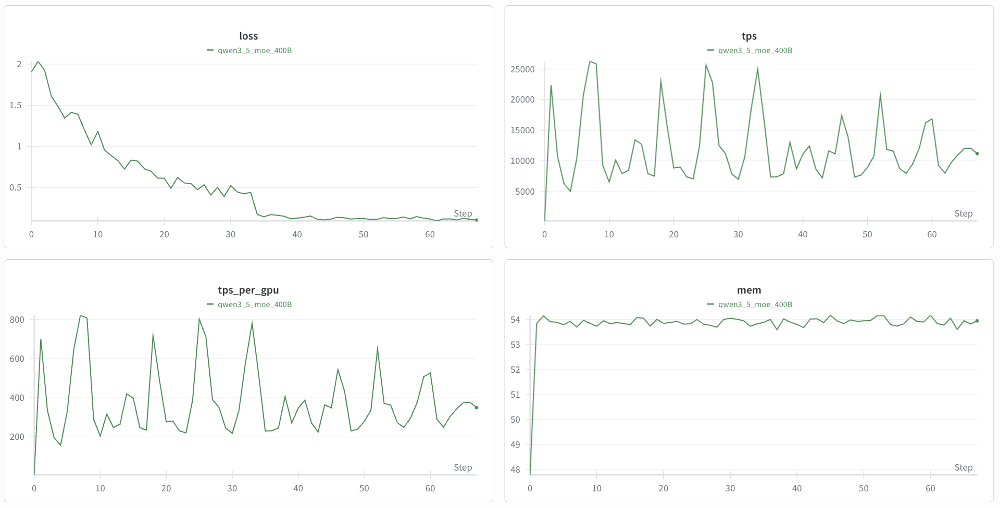

# Fine-Tune Qwen3.5-VL

## Introduction

[Qwen/Qwen3.5-397B-A17B](https://huggingface.co/Qwen/Qwen3.5-397B-A17B) is the latest vision-language model in the Qwen series developed by Alibaba. Qwen3.5 is a major upgrade that unifies vision+language, boosts efficiency and multilingual coverage, delivering higher performance at lower latency/cost for developers and enterprises.

This guide walks you through fine-tuning Qwen3.5 on a medical Visual Question Answering task using NeMo Automodel. You will learn how to prepare the dataset, launch training on a Slurm cluster, and inspect the results.

To set up your environment to run NeMo Automodel, follow the [installation guide](https://github.com/NVIDIA-NeMo/Automodel#-install-nemo-automodel).

## Data

### MedPix-VQA Dataset

We use the [MedPix-VQA](https://huggingface.co/datasets/mmoukouba/MedPix-VQA) dataset, a comprehensive medical Visual Question Answering dataset containing radiological images paired with question-answer pairs for medical image interpretation.

- **20,500 total examples** (85% train / 15% validation)
- **Columns**: `image_id`, `mode`, `case_id`, `question`, `answer`

For a full walkthrough of how MedPix-VQA is preprocessed and integrated into NeMo Automodel—including the chat-template conversion and collate functions—see the [Multi-Modal Dataset Guide](https://github.com/NVIDIA-NeMo/Automodel/blob/main/docs/guides/vlm/dataset.md#multi-modal-datasets).

## Launch Training

We provide a ready-to-use recipe at [`examples/vlm_finetune/qwen3_5_moe/qwen3_5_moe_medpix.yaml`](https://github.com/NVIDIA-NeMo/Automodel/blob/main/examples/vlm_finetune/qwen3_5_moe/qwen3_5_moe_medpix.yaml). This recipe is configured to run on 32 x 8 H100 nodes.

NeMo Automodel supports several ways to launch training—via the Automodel CLI with Slurm, interactive sessions, `torchrun`, and more. For full details on all launch options (Slurm batch jobs, multi-node configuration, environment variables, etc.), see the [Run on a Cluster](https://github.com/NVIDIA-NeMo/Automodel/blob/main/docs/launcher/cluster.md) guide.

### Standalone Slurm Script

We also provide a standalone Slurm script example for Qwen3.5. Before running it, ensure your cluster environment is configured following the [Standalone Slurm Script (Advanced)](https://github.com/NVIDIA-NeMo/Automodel/blob/main/docs/launcher/cluster.md#standalone-slurm-script-advanced) guide. Then submit the job with the following command:

```bash
export TRANSFORMERS_OFFLINE=1
export HF_HOME=your/path/to/hf_cache
export HF_DATASETS_OFFLINE=1
export WANDB_API_KEY=your_wandb_key

srun --output=output.out \
     --error=output.err \
     --container-image /your/path/to/automodel26.02.image.sqsh --no-container-mount-home bash -c "
  CUDA_DEVICE_MAX_CONNECTIONS=1 CUDA_VISIBLE_DEVICES=0,1,2,3,4,5,6,7 python3 examples/vlm_finetune/finetune.py \
  -c examples/vlm_finetune/qwen3_5_moe/qwen3_5_moe_medpix.yaml \
  --model.pretrained_model_name_or_path=/your/local/qwen3.5weights \
  --processor.pretrained_model_name_or_path=/your/local/qwen3.5weights "
```

**Before you start**:
- Hugging Face applies rate limits on downloads. We recommend cloning the model repository to your local filesystem beforehand.
- Ensure your Hugging Face cache (`HF_HOME`) is configured and that the dataset is already cached locally.
- To enable Weights & Biases logging, set your `WANDB_API_KEY` and configure the `wandb` section in the YAML file.

## Training Results

The training loss curves for Qwen3.5-VL fine-tuned on MedPix-VQA are shown below.

<p align="center">
  
</p>