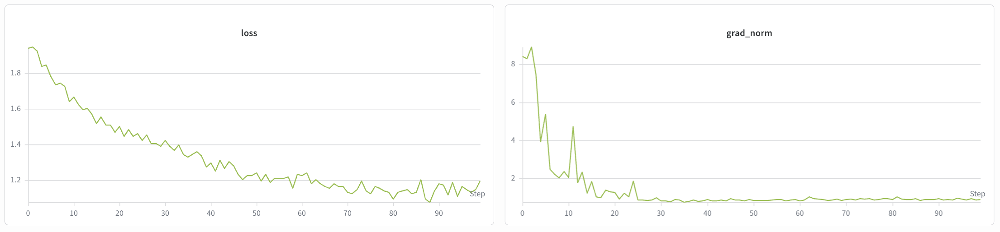
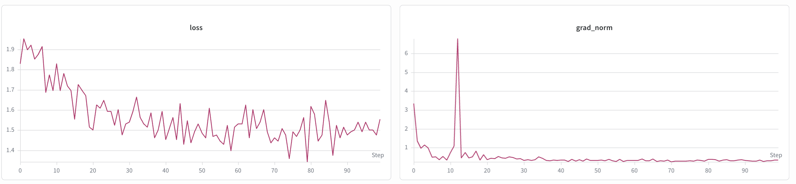

# Fine-Tune Step-3.7-Flash

## Introduction

[stepfun-ai/Step-3.7-Flash](https://huggingface.co/stepfun-ai/Step-3.7-Flash) is StepFun's mixture-of-experts (MoE) vision-language model. The [upstream model card](https://huggingface.co/stepfun-ai/Step-3.7-Flash/blob/5f6244077ac62e04eec3f320501ff8c2b293373a/README.md) describes 198B total parameters and approximately 11B active parameters per token, with native image understanding.

This guide covers supervised fine-tuning (SFT) and low-rank adaptation (LoRA) with the checked-in MedPix image question-answering recipes. Both recipes freeze the vision tower and train the language model or its adapters.

To set up your environment to run NeMo AutoModel, follow the [installation guide](https://github.com/NVIDIA-NeMo/Automodel/blob/main/docs/guides/installation.mdx).

## Model Overview

### Architecture

- **Model type:** 198B total parameters and approximately 11B active parameters per token, as reported by StepFun.
- **Language module:** Step-3.5-Flash-derived backbone with 45 layers, 288 experts, 8 activated experts per token, and a 256k context length.
- **Vision module:** 1.8B vision transformer with 47 layers and a configured image size of 728 by 728 pixels.
- **Training precision:** Both recipes select BF16 (`torch_dtype: bfloat16`). Upstream FP8 and NVFP4 deployment examples do not establish training support in these recipes.

The architecture settings are recorded in the [pinned upstream configuration](https://huggingface.co/stepfun-ai/Step-3.7-Flash/blob/5f6244077ac62e04eec3f320501ff8c2b293373a/config.json). The recipes set the collator's `max_length` to 2048; the model's 256k context length is not the configured training sequence length.

### Agentic Positioning

The upstream model card describes developer workflows with visual context and integration with agent platforms such as OpenClaw, Hermes Agent, and Kilo Code. The recipes below demonstrate image question-answering fine-tuning, rather than an agent deployment.

## Data

### Multimodal Supervised Fine-Tuning Data

The supplied recipes load `mmoukouba/MedPix-VQA` through `make_medpix_dataset`, which converts each image, question, and answer into a conversation. To adapt the recipe, use image instruction data that matches your task, such as:

- Frontend mockup-to-project examples.
- Screenshot-debugging conversations.
- Structured data-processing tasks with visual context.
- Image question-answer pairs.

For a full walkthrough of how multimodal datasets are preprocessed and integrated into NeMo AutoModel, including chat-template conversion and collate functions, see the [Multi-Modal Dataset Guide](https://github.com/NVIDIA-NeMo/Automodel/blob/main/docs/guides/vlm/dataset.mdx#multi-modal-datasets).

## Launch Training

Use the checked-in [full SFT recipe](https://github.com/NVIDIA-NeMo/Automodel/blob/main/examples/vlm_finetune/stepfun/step3p7_medpix_200b_ep32pp4.yaml) or [LoRA recipe](https://github.com/NVIDIA-NeMo/Automodel/blob/main/examples/vlm_finetune/stepfun/step3p7_medpix_200b_lora_pp8ep8_8node.yaml). Both use `stepfun-ai/Step-3.7-Flash` for the model and processor, FSDP2, pipeline parallelism (PP), and expert parallelism (EP).

| Recipe | Configured Topology | Nodes at 8 GPUs per Node | Expert Dispatcher |
| --- | --- | --- | --- |
| Full SFT | PP4, EP32; 128 GPUs | 16 | `hybridep` |
| LoRA | PP8, EP8; 64 GPUs | 8 | `deepep` |

These are the recipe layouts, not a general minimum-memory recommendation. Tensor and context parallelism are both 1. EP partitions the non-pipeline ranks; the node counts follow the recipes' CI settings, which specify eight H100 GPUs per node in their comments.

### Prepare the Environment

1. Configure Slurm and Pyxis using the [Run on a Cluster](https://github.com/NVIDIA-NeMo/Automodel/blob/main/docs/launcher/slurm.mdx) guide.
2. Use a container with the VLM, Transformer Engine, and MoE dependencies required by this checkout. Full SFT selects HybridEP across nodes, so its build needs `HYBRID_EP_MULTINODE=1` and the communication dependencies configured in the repository [Dockerfile](https://github.com/NVIDIA-NeMo/Automodel/blob/main/docker/Dockerfile). LoRA selects DeepEP. Installing the `moe` extra alone does not configure a multi-node HybridEP build.
3. Place a local copy of `stepfun-ai/Step-3.7-Flash` under the shared data directory as `Step-3.7-Flash`. Cache the MedPix dataset under `hf_cache` before using the offline settings below.
4. Make the checkout and data directories accessible from every node. Replace the account, partition, container, and mount paths in the script. The checkout mount must be writable for the recipes' relative checkpoint and metric-log paths.

### Launch a Slurm Batch Job

Save this script as `step3p7.sub` and submit it with `sbatch step3p7.sub`. It launches the full SFT recipe with one `torchrun` launcher per node and eight workers per launcher. The shared rendezvous connects all 128 workers to the same job.

```bash
#!/bin/bash
#SBATCH --account=your_account
#SBATCH --partition=your_partition
#SBATCH --nodes=16
#SBATCH --gpus-per-node=8
#SBATCH --ntasks-per-node=1
#SBATCH --time=01:00:00
#SBATCH --output=step3p7-%j.out
#SBATCH --error=step3p7-%j.err

set -euo pipefail
export RECIPE=examples/vlm_finetune/stepfun/step3p7_medpix_200b_ep32pp4.yaml
export MASTER_ADDR=$(scontrol show hostnames "$SLURM_JOB_NODELIST" | head -n 1)
export MASTER_PORT=29500
export HF_HOME=/data/hf_cache
export TRANSFORMERS_OFFLINE=1 HF_DATASETS_OFFLINE=1
export CUDA_DEVICE_MAX_CONNECTIONS=1

srun --export=ALL \
     --container-image=/path/to/automodel.sqsh \
     --container-mounts=/path/to/Automodel:/workspace/Automodel,/path/to/data:/data \
     --container-workdir=/workspace/Automodel \
     --no-container-mount-home bash -c '
  exec torchrun \
    --nnodes="$SLURM_NNODES" \
    --nproc-per-node=8 \
    --rdzv-backend=c10d \
    --rdzv-endpoint="$MASTER_ADDR:$MASTER_PORT" \
    --rdzv-id="$SLURM_JOB_ID" \
    -m nemo_automodel.cli.app "$RECIPE" \
    --model.pretrained_model_name_or_path=/data/Step-3.7-Flash \
    --processor.pretrained_model_name_or_path=/data/Step-3.7-Flash
  '
```

For LoRA, change `#SBATCH --nodes=16` to `#SBATCH --nodes=8` and set `RECIPE` to `examples/vlm_finetune/stepfun/step3p7_medpix_200b_lora_pp8ep8_8node.yaml`.

### Locate Training Outputs

- Slurm writes standard output and errors to `step3p7-<job_id>.out` and `step3p7-<job_id>.err` in the submission directory.
- Training metrics are written to `training.jsonl` under `checkpoint.checkpoint_dir`, relative to `/workspace/Automodel` in this example. Full SFT uses `vlm_checkpoints/step3p7_medpix_ep32pp4/`; LoRA uses `vlm_checkpoints/step3p7_medpix_lora_pp8ep8_8node/`.
- Full SFT enables checkpoint saving. Checkpoints use `epoch_<epoch>_step_<step>` subdirectories under its checkpoint directory. LoRA disables saving by default; set `enabled: true` in the `checkpoint` section of a recipe copy to retain trained adapters. Checkpoints are saved at the final training step when saving is enabled, even if the configured checkpoint interval exceeds the run length.
- Both recipes disable Weights & Biases (W&B). To enable remote curves, set `enable: true` in the `wandb` section, replace the placeholder project, entity, name, and directory values, and authenticate W&B in the job environment.
- Both recipes use pipeline parallelism, for which this training loop skips validation. The configured validation dataset does not produce validation-loss curves in these runs.

## Training Results

The historical SFT and LoRA training-loss plots included with this guide are shown below. The guide does not record their exact run revisions or hyperparameters.

**SFT**

<p align="center">
  
</p>

**LoRA**

<p align="center">
  
</p>
