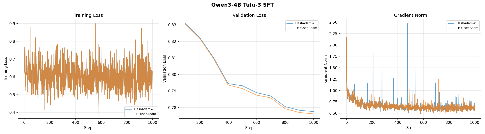

# Qwen3-4B — Tulu-3 Convergence

Dense 4B model. 8 GPUs, CP=1, FSDP, 1000 steps on Tulu-3 (pre-filtered to seq_length=2048).

## Configs

| Config | Optimizer | lr | Notes |
|--------|-----------|---:|-------|
| `qwen3_4b_cp1_flashoptim.yaml` | FlashAdamW | 1e-5 | 24-bit master weights |
| `qwen3_4b_cp1_te_fusedadam.yaml` | TE FusedAdam | 1e-5 | FP32 master weights, FP32 moments |

All configs use `chat_template.jinja` (strips `<think>` tags), `seq_length: 2048`, `betas: [0.9, 0.95]`.

Data must be pre-filtered before training:

```bash
python data/prefilter_dataset.py \
    --dataset allenai/tulu-3-sft-mixture \
    --model Qwen/Qwen3-4B-Base \
    --seq_length 2048 \
    --cache_dir /tmp/tulu3_filtered
```

Then pass the cached path via `--dataset.path_or_dataset_id <cached_dir>`.

> **Note**: TE FusedAdam requires `local_batch_size: 2` (not 8) to avoid NCCL errors during checkpoint consolidation. The larger optimizer state (FP32 master weights + remainders) exhausts GPU memory headroom needed by the NCCL gather.

## Results (rebased on main)

### IFEval Results

| Model | prompt_strict | prompt_loose | inst_strict | inst_loose |
|-------|-------------:|-------------:|------------:|-----------:|
| Qwen3-4B-Base (pretrained) | 0.274 | 0.296 | 0.416 | 0.444 |
| SFT from Base, FlashAdamW | **0.610** | 0.625 | **0.704** | 0.719 |
| SFT from Base, TE FusedAdam | 0.612 | **0.634** | 0.705 | **0.725** |

### Inference Quality

Failure modes detected by `inference/analyze_quality.py` on IFEval outputs.

| Model | Death Loop | Abrupt Ending | Missing EOS | Empty |
|-------|----------:|--------------:|------------:|------:|
| Qwen3-4B-Base (pretrained) | 12.0% | **61.4%** | 0% | 0% |
| SFT from Base, FlashAdamW | 15.0% | 20.0% | 0% | 0% |
| SFT from Base, TE FusedAdam | 17.6% | 22.2% | 0% | 0% |

SFT dramatically reduces abrupt endings (61% → 20%) as the model learns complete response patterns. Death loop rate increases slightly (12% → 15-18%) — the model sometimes gets stuck repeating content it learned from training.

### Training Loss

| Config | Step 0 | Step 999 | Val Loss |
|--------|-------:|---------:|---------:|
| FlashAdamW lr=1e-5 (lbs=8) | 0.77 | ~0.60 | 0.78 |
| TE FusedAdam lr=1e-5 (lbs=2) | 0.77 | 0.63 | 0.78 |

### Training Curves

