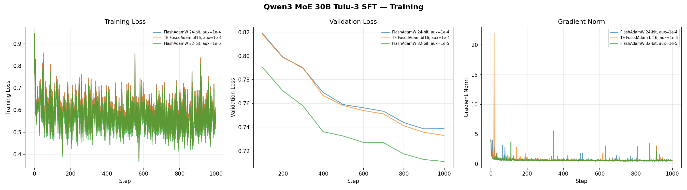
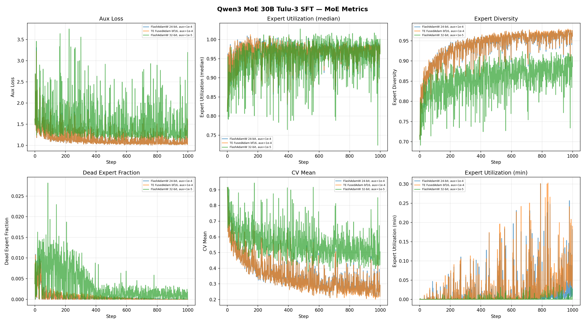

# Qwen3 MoE 30B — Tulu-3 Convergence

MoE 30B (3B active) model. 8 GPUs, EP=8, FSDP, 1000 steps on Tulu-3 (pre-filtered to seq_length=2048).

## Configs

| Config | Optimizer | lr | Notes |
|--------|-----------|---:|-------|
| `qwen3_moe_30b_ep8_flashoptim.yaml` | FlashAdamW | 1e-5 | 24-bit master weights |
| `qwen3_moe_30b_ep8_te_fusedadam.yaml` | TE FusedAdam | 1e-5 | FP32 master weights, BF16 moments |

All configs use `chat_template.jinja`, `seq_length: 2048`, `betas: [0.9, 0.95]`, `ep_size: 8`, `rms_norm: torch_fp32`, TE attn+linear backends, `router_aux_loss_coef: 0.0001`, `moe_metrics: brief`.

## Results

### IFEval Results

| Model | prompt_strict | prompt_loose | inst_strict | inst_loose |
|-------|-------------:|-------------:|------------:|-----------:|
| Qwen3-30B-A3B-Base (pretrained) | 0.318 | 0.420 | 0.441 | 0.543 |
| FlashAdamW 24-bit, aux=1e-4 | 0.553 | 0.586 | 0.720 | 0.747 |
| TE FusedAdam FP32+BF16, aux=1e-4 | 0.545 | 0.590 | 0.714 | 0.750 |
| FlashAdamW 32-bit, aux=1e-5 | 0.617 | 0.641 | 0.717 | 0.740 |
| FlashAdamW 32-bit, aux=1e-5 (temp=0.7, top_p=0.8) | 0.617 | 0.649 | 0.712 | 0.743 |

### Inference Quality

| Model | Death Loop | Abrupt Ending | Missing EOS | Empty |
|-------|----------:|--------------:|------------:|------:|
| Qwen3-30B-A3B-Base (pretrained) | 33.8% | 38.4% | 0% | 0% |
| FlashAdamW 24-bit, aux=1e-4 | 8.9% | 16.5% | 0% | 1.8% |
| TE FusedAdam FP32+BF16, aux=1e-4 | 9.1% | 15.7% | 0% | 2.0% |
| FlashAdamW 32-bit, aux=1e-5 | 8.9% | 14.2% | 0% | 0.4% |
| FlashAdamW 32-bit, aux=1e-5 (temp=0.7, top_p=0.8) | 6.5% | 12.9% | 0% | 0.2% |

### Training Loss

| Config | Step 0 | Step 999 | Val Loss |
|--------|-------:|---------:|---------:|
| FlashAdamW 24-bit, aux=1e-4 | ~0.83 | ~0.55 | 0.74 |
| TE FusedAdam FP32+BF16, aux=1e-4 | ~0.83 | ~0.55 | 0.73 |
| **FlashAdamW 32-bit, aux=1e-5** | ~0.83 | ~0.53 | **0.71** |

### Training Curves

### MoE Metrics

